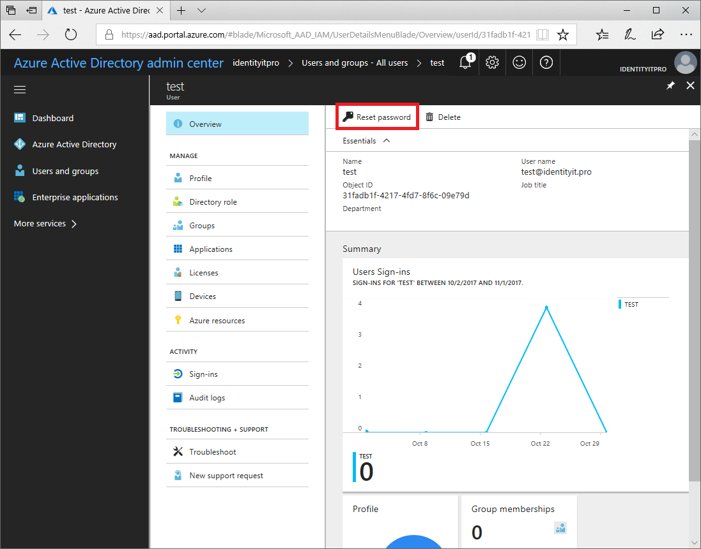

---

title: Password reset in Azure Active Directory | Microsoft Docs
description: Administrator initiated password reset for a user in Azure Active Directory
services: active-directory
documentationcenter: ''
author: MicrosoftGuyJFlo
manager: femila
editor: ''

ms.assetid: fad5624b-2f13-4abc-b3d4-b347903a8f16
ms.service: active-directory
ms.workload: identity
ms.tgt_pltfrm: na
ms.devlang: na
ms.topic: article
ms.date: 11/01/2017
ms.author: joflore
ms.reviewer: sahenry
ms.custom: it-pro

---
# Reset the password for a user in Azure Active Directory

Administrators may need to reset a user's password in cases where they forgot, were locked out, or other scenarios. The steps that follow guide you through resetting a user's password.

## How to reset the password for a user

1. Sign in to the [Azure AD Admin Center](https://aad.portal.azure.com) with an account that has directory permissions to reset user passwords.
2. Select  **Azure Active Directory** > **Users and groups** > **All users**.
3. Select the user you would like to reset the password for.
2. For the selected user, select **Reset password**.

    
    
6. On **Reset password**, select **Reset password**.
7. A temporary password is displayed that you can then provide to the user. The user will be asked to then change their password the next time they logon. 

   > [!NOTE]
   > This temporary password does not have an expiration time so it will be valid until they log in and are then are forced to change it. 

## Next steps
* [Add a user](active-directory-users-create-azure-portal.md)
* [Assign administrator roles to a user](active-directory-users-assign-role-azure-portal.md)
* [Manage user profiles](active-directory-users-profile-azure-portal.md)
* [Delete a user in Azure AD](active-directory-users-delete-user-azure-portal.md)
