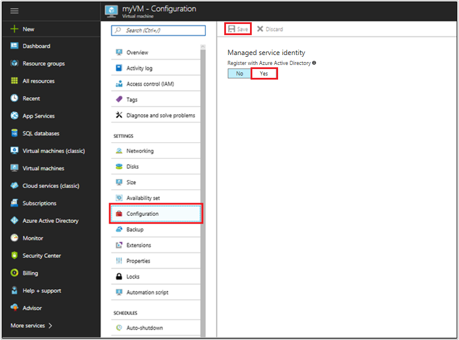

# Configure a VM Managed Service Identity (MSI) using the Azure portal

[!INCLUDE[preview-notice](../../includes/active-directory-msi-preview-notice.md)]

Managed Service Identity provides Azure services with an automatically managed identity in Azure Active Directory. You can use this identity to authenticate to any service that supports Azure AD authentication, without having credentials in your code. 

In this article, you will learn how to enable and remove MSI for an Azure VM, using the Azure portal.

## Prerequisites

[!INCLUDE [msi-qs-configure-prereqs](../../includes/active-directory-msi-qs-configure-prereqs.md)]

## Enable MSI during creation of an Azure VM

As of the time of this writing, enabling MSI during creation of a VM in the Azure portal is not supported. Instead, please refer to one of the following VM creation Quickstart articles to first create a VM:

- [Create a Windows virtual machine with the Azure portal](../virtual-machines/windows/quick-create-portal.md#create-virtual-machine)
- [Create a Linux virtual machine with the Azure portal](../virtual-machines/linux/quick-create-portal.md#create-virtual-machine)  

Then proceed to the next section for details on enabling MSI on the VM.

## Enable MSI on an existing Azure VM

If you have a VM that was originally provisioned without an MSI:

1. Sign in to the [Azure portal](https://portal.azure.com) using an account associated with the Azure subscription that contains the VM. Also make sure your account belongs to a role that gives you write permissions on the VM, such as “Virtual Machine Contributor”.

2. Navigate to the desired Virtual Machine.

2. Click the "Configuration" page, enable MSI on the VM by selecting "Yes" under "Managed service identity", then click **Save**. This operation can take 60 seconds or more to complete:

     

## Remove MSI from an Azure VM

If you have a Virtual Machine that no longer needs an MSI:

1. Sign in to the [Azure portal](https://portal.azure.com) using an account associated with the Azure subscription that contains the VM. Also make sure your account belongs to a role that gives you write permissions on the VM, such as “Virtual Machine Contributor”.

2. Navigate to the desired Virtual Machine.

3. Click the "Configuration" page, remove MSI from the VM by selecting "No" under "Managed service identity", then click **Save**. This operation can take 60 seconds or more to complete:

     

## Related content

- For an overview of MSI, see [Managed Service Identity overview](msi-overview.md).

## Next steps

- Using the Azure portal, give an Azure VM's MSI [access to another Azure resource](msi-howto-assign-access-portal.md).

Use the following comments section to provide feedback and help us refine and shape our content.
