---
title: Overview of Azure PIM Resource RBAC | Microsoft Docs
description: Get an overview of the RBAC feature in PIM including Terminology and notifications
services: active-directory
documentationcenter: ''
author: barclayn
manager: mbaldwin
editor: ''

ms.assetid:
ms.service: active-directory
ms.devlang: na
ms.topic: article
ms.tgt_pltfrm: na
ms.workload: identity
ms.date: 09/19/2017
ms.author: barclayn

---
# PIM for Azure resources (Preview)

With Azure Active Directory Privileged Identity Management (PIM), you can now manage, control, and monitor access to Azure Resources (Preview) within your organization. This includes Subscriptions, Resource Groups, and even Virtual Machines. Any resource within the Azure portal that leverages the Azure Role Based Access Control (RBAC) functionality can take advantage of all the great security and lifecycle management capabilities Azure AD PIM has to offer, and some great new features we plan to bring to Azure AD roles soon. 

## PIM for Azure Resources (Preview) helps resource administrators

- See which users and groups are assigned roles for the Azure resources you administer
- Enable on-demand, "just in time" access to manage resources such as Subscriptions, Resource Groups, and more
- Expire assigned users/groups resource access automatically with new time-bound assignment settings
- Assign temporary resource access for quick tasks or on-call schedules
- Enforce Multi-Factor Authentication for resource access on any built-in or custom role 
- Get reports about resource access correlated resource activity during a user’s active session
- Get alerts when new users or groups are assigned resource access, and when they activate eligible assignments

Azure AD PIM can manage the built-in Azure Resource roles, as well as custom (RBAC) roles, including (but not limited to):

- Owner
- User Access Administrator
- Contributor
- Security Admin
- Security Manager, and more

>[!NOTE]
Users or members of a group assigned to the Owner or User Access Administrator roles, and Global Administrators that enable subscription management in Azure AD are Resource Administrators. These administrators may assign roles, configure role settings, and review access using PIM for Azure Resources. View the list of [built-in roles for Azure resources](../role-based-access-built-in-roles.md).

## Tasks

PIM provides convenient access to activate roles, view pending activations/requests, pending approvals (for [Azure AD directory roles](azure-ad-pim-approval-workflow.md)), and reviews pending your response from the Tasks section of the left navigation menu.

When accessing any of the Tasks menu items from the Overview entry point, the resulting view contains results for both Azure AD directory roles and Azure Resource roles (Preview). 

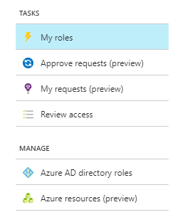

My roles contain a list of your active and eligible role assignments for Azure AD directory roles, and Azure Resource roles (Preview).

## Activate roles

Activating roles for Azure Resources (Preview) introduces a new experience that allows eligible role members to schedule activation for a future date/time and select a specific activation duration within the maximum (configured by administrators). Learn about [activating Azure AD roles here](../active-directory-privileged-identity-management-how-to-activate-role.md).

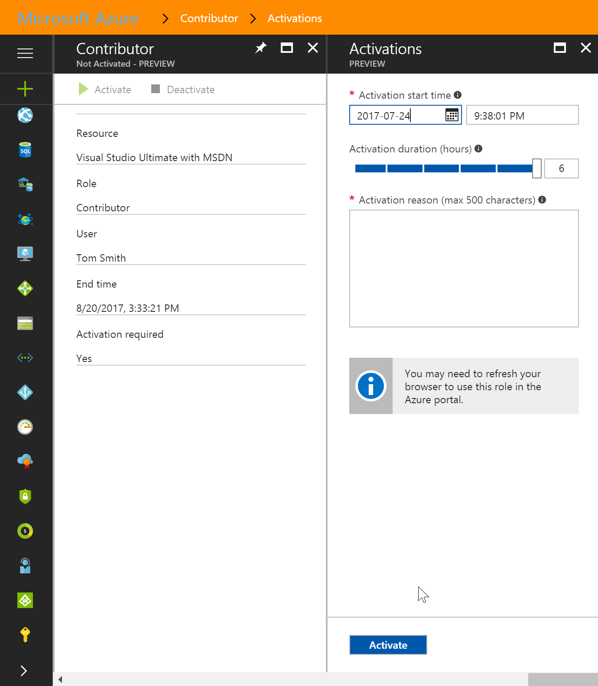

From the Activations menu, input the desired start date and time to activate the role. Optionally decrease the activation duration (the length of time the role is active) and enter a justification if required; click activate.

If the start date and time is not modified, the role will be activated within seconds. You will see a role queued for activation banner message on the My Roles page. Click the refresh button to clear this message.

If the activation is scheduled for a future date time, the pending request will appear in the Pending Requests tab of the left navigation menu. In the event the role activation is no longer required, the user may cancel the request by clicking the Cancel button on the right side of the page.

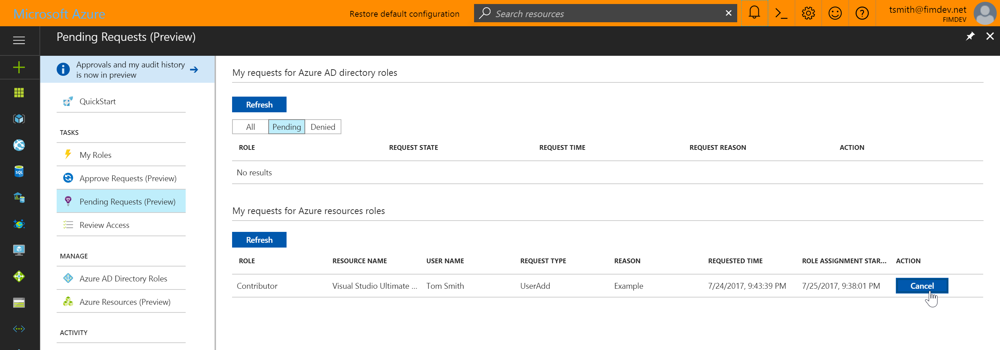

## Discover and manage Azure resources

To find and manage roles for an Azure Resource, select Azure Resources (Preview) under the Manage tab in the left navigation menu. Use the filters or search bar at the top of the page to find a resource.

## Resource dashboards

The Admin View dashboard has four primary components. A graphical representation of resource role activations over the past seven days. This data is scoped to the selected resource and displays activations for the most common roles (Owner, Contributor, User Access Administrator), and all roles combined.

To the right of the activations graph, are two charts that display the distribution of role assignments by assignment type, for both users and groups. Selecting a slice of the chart changes the value to a percentage (or vice versa).

Below the charts, you see the number of users and groups with new role assignments over the last 30 days (left), and a list of roles sorted by total assignments (descending).

## Manage role assignments

Administrators can manage role assignments by selecting either Roles or Members from the left navigation. Selecting roles allows admins to scope their management tasks to a specific role, while Members displays all user and group role assignments for the resource.

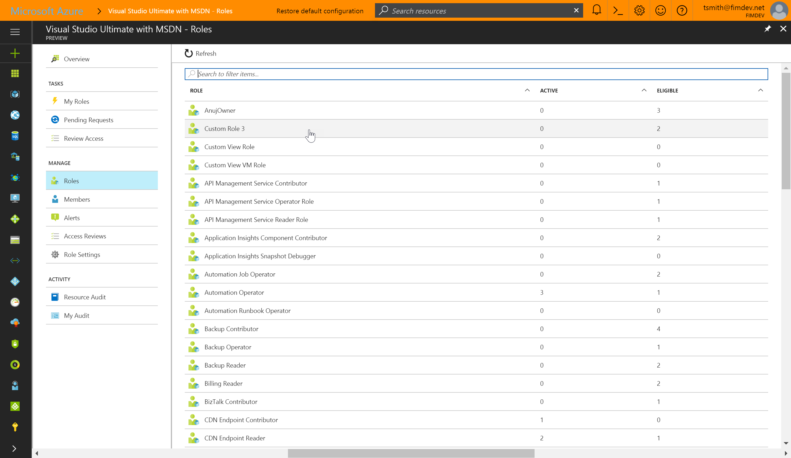

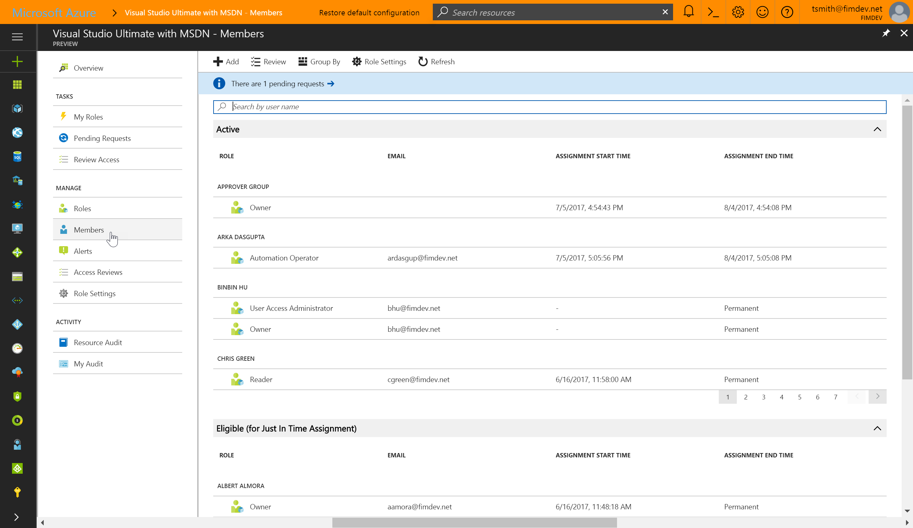

>[!NOTE]
If you have a role pending activation, a notification banner is displayed at the top of the page when viewing membership.

## Assign roles

To assign a user or group to a role, select the role (if viewing Roles), or click Add from the action bar (if on the Members view).

>[!NOTE]
If adding a user or group from the Members tab, you’ll need to select a role from the Add menu before you can select a user or group.

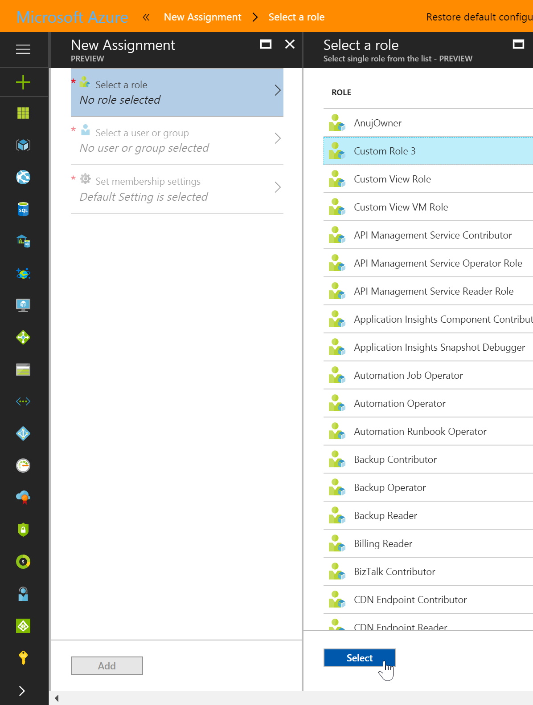

Choose a user or group from the directory.

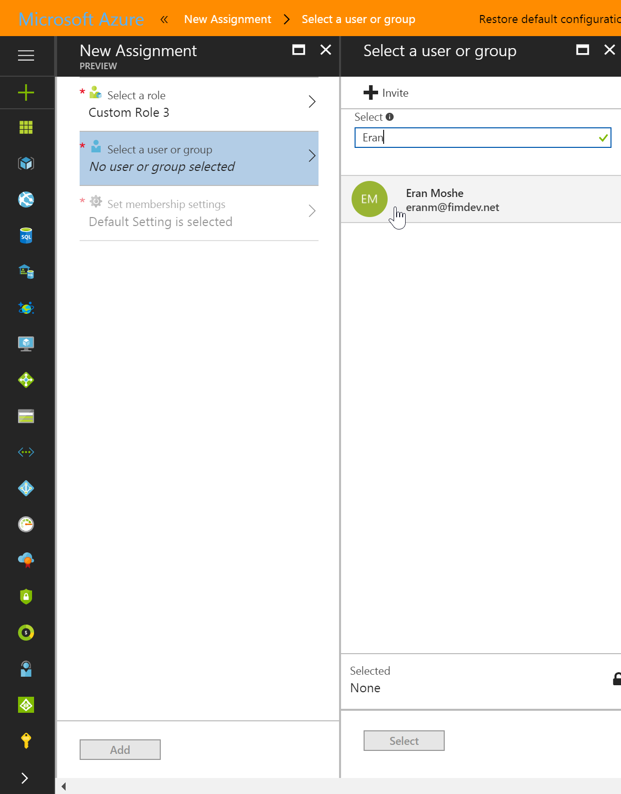

Choose the appropriate assignment type from the dropdown menu. 

**Just In Time Assignment:** It provides the user or group members with eligible but not persistent access to the role for a specified period of time or indefinitely (if configured in role settings). 

**Direct Assignment:** It does not require the user or group members to activate the role assignment (known as persistent access). Microsoft recommends using direct assignment for short-term use such as on-call shifts, or time sensitive activities, where access won’t be required when the task is complete.

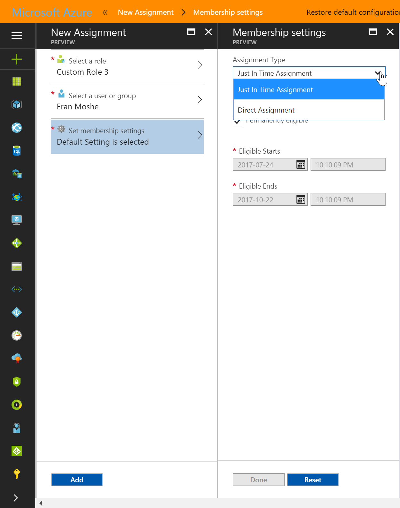

A check box below the assignment type dropdown allows you to specify if the assignment should be permanent (permanently eligible to activate Just in Time Assignment/permanently active for Direct Assignment). To specify a specific assignment duration, unselect the check box and modify the start and/or end date and time fields.

>[!NOTE]
The check box may be unmodifiable if another administrator has specified the maximum assignment duration for each assignment type in the role settings.

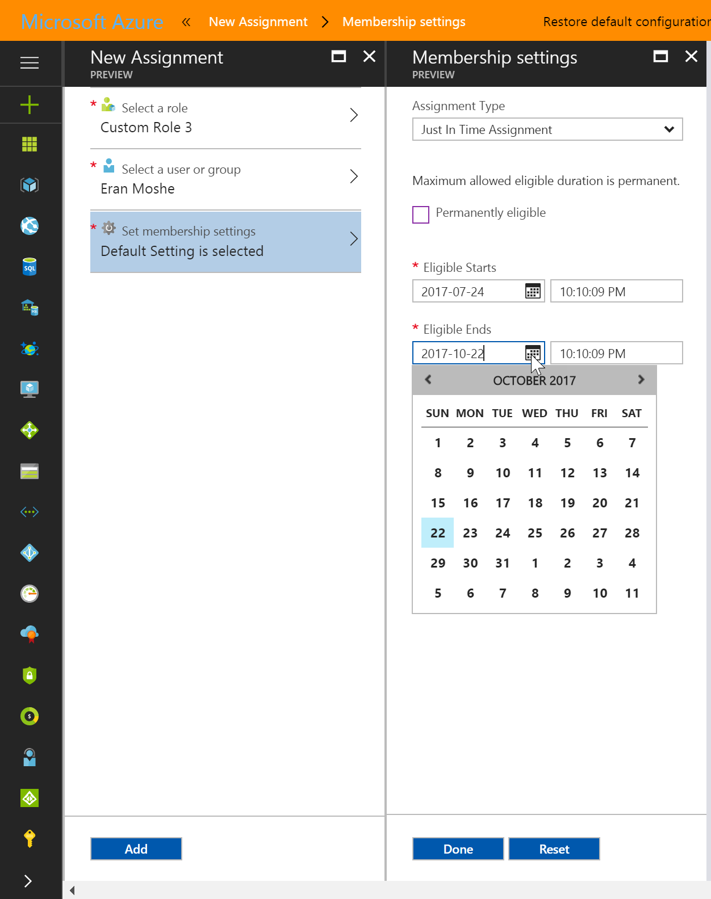

## View activation and Azure Resource activity

In the event you need to see what actions a specific user took on various resources, you can review the Azure Resource activity associated with a given activation period (for eligible users). Start by selecting a user from the Members view or from the list of members in a specific role. The result displays a graphical view of the user’s actions on Azure Resources by date, and the recent role activations over that same time period.

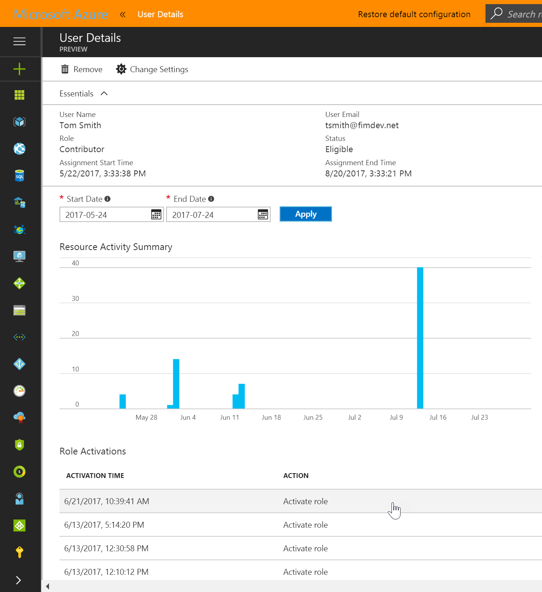

Selecting a specific role activation will show the role activation details, and corresponding Azure Resource activity that occurred while that user was active.

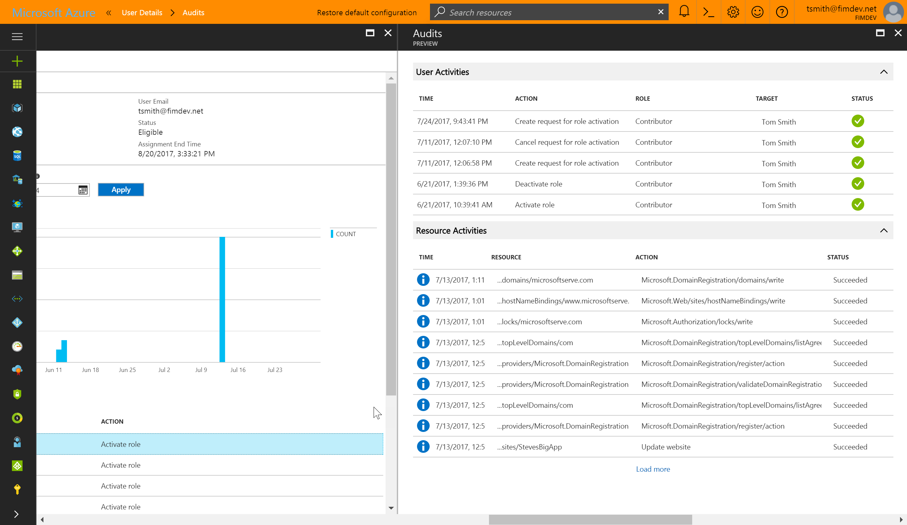

## Modify existing assignments

To modify existing assignments from the user/group detail view, select Change Settings from the action bar at the top of the page. Change the assignment type to Just In Time Assignment or Direct Assignment.

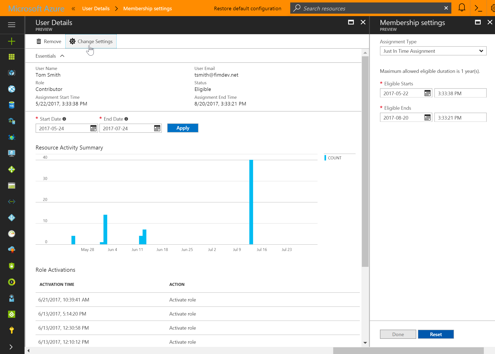

## Review who has access in a subscription

To review role assignments in your Subscription, select the Members tab from the left navigation, or select roles, and choose a specific role to review members. 

Select Review from the action bar to view existing access reviews and select Add to create a new review.

[Learn more about access reviews](../active-directory-privileged-identity-management-how-to-perform-security-review.md)

>[!NOTE]
Reviews are only supported for Subscription resource types at this time.

## Configure role settings

Configuring role settings define the defaults applied to assignments in the PIM environment. To define these for your resource, select the Role Settings tab from the left navigation, or the role settings button from the action bar in any role to view the current options.

Clicking Edit from the action bar at the top of the page allows you to modify each setting.

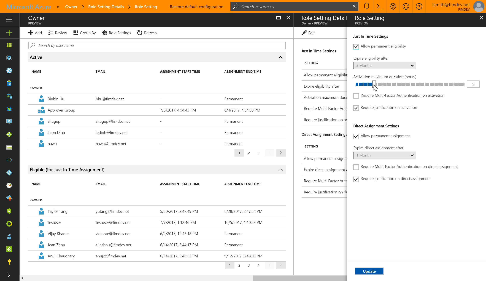

Changes to settings are logged on the role settings page including the last updated date time, and the administrator that changed the settings.

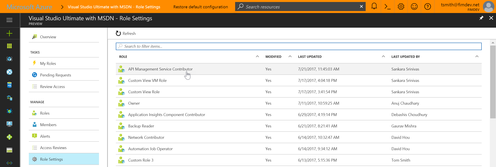

## Resource audit

Resource audit gives you a view of all role activity for the resource. You can filter the information using a predefined date or custom range.
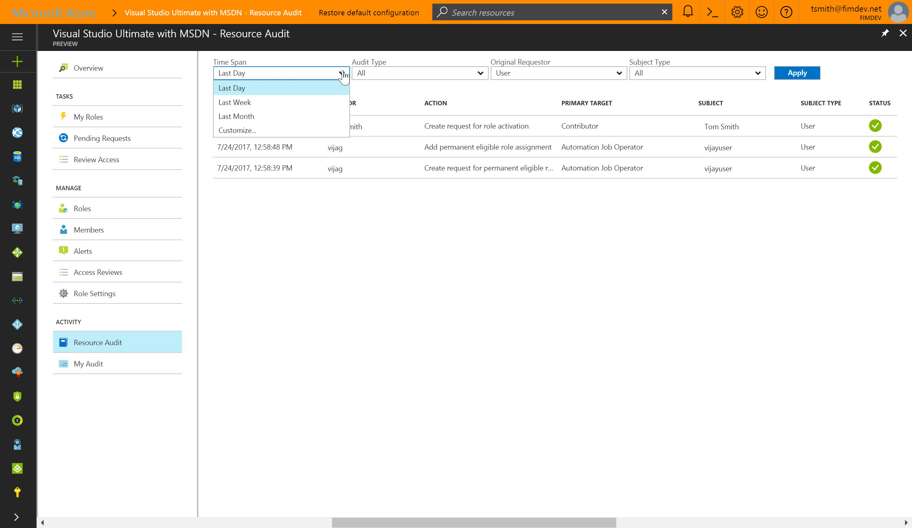
Resource audit also provides quick access to view a user’s activity detail. In the view, all “Activate role” Actions are links to the specific requestor’s resource activity.

## Just enough administration

Using just enough administration (JEA) best practices with your resource role assignments is simple with PIM for Azure Resources. Users and group members with assignments in Azure Subscriptions or Resource Groups can activate their existing role assignment at a reduced scope. 

From the search page, find the subordinate resource you need to manage.

Select My roles from the left navigation menu and choose the appropriate role to activate. Notice the assignment type is Inherited, since the role was assigned at the subscription, rather than the resource group, as shown below.

## Next steps

- [Built-in roles for Azure resources](../role-based-access-built-in-roles.md)
- Learn about [activating Azure AD roles here](../active-directory-privileged-identity-management-how-to-activate-role.md)
- [PIM approval workflows](azure-ad-pim-approval-workflow.md)
