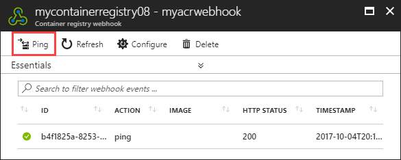

# Using Azure Container Registry webhooks

An Azure container registry stores and manages private Docker container images, similar to the way Docker Hub stores public Docker images. You use webhooks to trigger events when certain actions take place in one of your registry repositories. Webhooks can respond to events at the registry level, or they can be scoped down to a specific repository tag.

For more background and concepts, see [About Azure Container Registry](./container-registry-intro.md).

## Prerequisites

- Azure container managed registry - Create a managed container registry in your Azure subscription. For example, use the [Azure portal](container-registry-get-started-portal.md) or the [Azure CLI](container-registry-get-started-azure-cli.md).
- Docker CLI - To set up your local computer as a Docker host and access the Docker CLI commands, install [Docker Engine](https://docs.docker.com/engine/installation/).

## Create webhook Azure portal

1. Log in to the [Azure portal](https://portal.azure.com) and navigate to the registry in which you want to create webhooks.

2. In the container blade, select **Webhooks** under **SERVICES**.

3. Select **Add** in the webhook blade toolbar.

4. Complete the *Create webhook* form with the following information:

| Value | Description |
|---|---|
| Name | The name you want to give to the webhook. It may contain only lowercase letters and numbers, and must be 5-50 characters in length. |
| Service URI | The URI where the webhook should send POST notifications. |
| Custom headers | Headers you want to pass along with the POST request. They should be in "key: value" format. |
| Trigger actions | Actions that trigger the webhook. Webhooks can currently be triggered by image push and/or delete actions. |
| Status | The status for the webhook after it's created. It's enabled by default. |
| Scope | The scope at which the webhook works. By default, the scope is for all events in the registry. It can be specified for a repository or a tag by using the format "repository:tag". |

Example webhook form:


## Create webhook Azure CLI

To create a webhook using the Azure CLI, use the [az acr webhook create](/cli/azure/acr/webhook#create) command.

```azurecli-interactive
az acr webhook create --registry mycontainerregistry --name myacrwebhook01 --actions delete --uri http://webhookuri.com
```

## Test webhook

### Azure portal

Prior to using the webhook on container image push and delete actions, you can test it with the **Ping** button. Ping sends a generic POST request to the specified endpoint and logs the response. This can help you verify you've correctly configured the webhook.

1. Select the webhook you want to test.
2. In the top toolbar, select **Ping**.
3. Check the endpoint's response in the **HTTP STATUS** column.



### Azure CLI

To test an ACR webhook with the Azure CLI, use the [az acr webhook ping](/cli/azure/acr/webhook#ping) command.

```azurecli-interactive
az acr webhook ping --registry mycontainerregistry --name myacrwebhook01
```

To see the results, use the [az acr webhook list-events](/cli/azure/acr/webhook#list-events) command.

```azurecli-interactive
az acr webhook list-events --registry mycontainerregistry08 --name myacrwebhook01
```

## Delete webhook

### Azure portal

Each webhook can be deleted by selecting the webhook and then the **Delete** button in the Azure portal.

### Azure CLI

```azurecli-interactive
az acr webhook delete --registry mycontainerregistry --name myacrwebhook01
```
