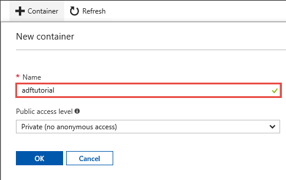
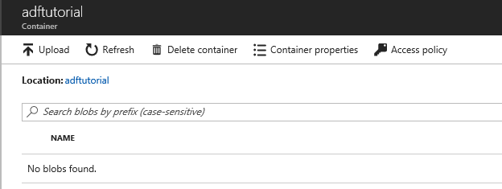
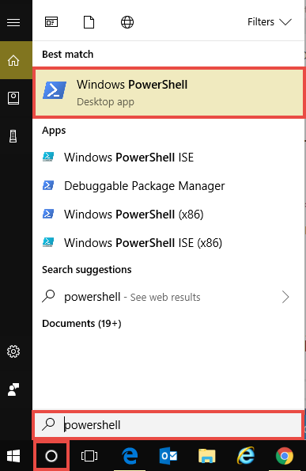
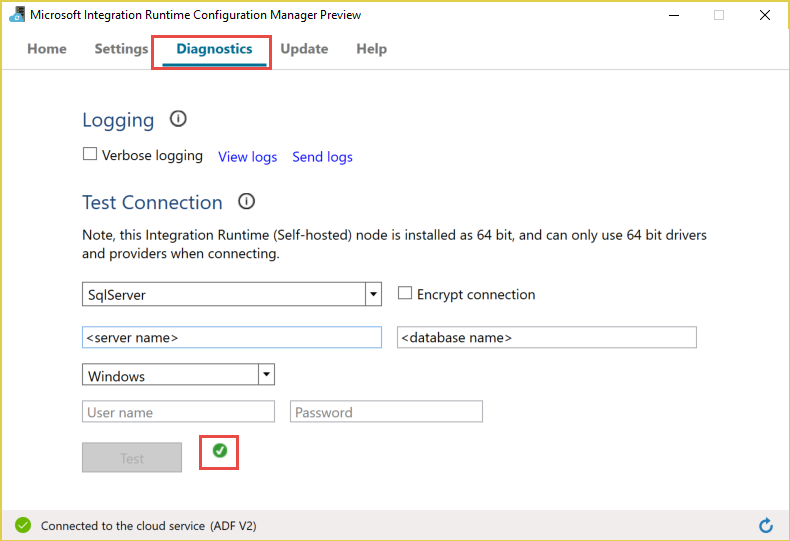
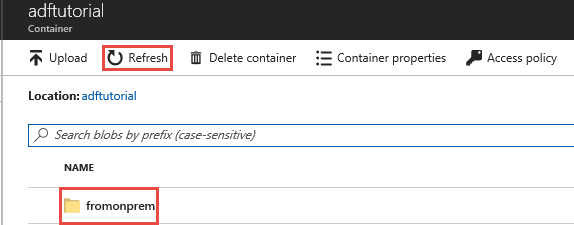
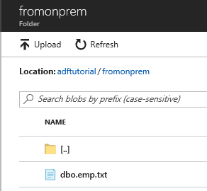

# Tutorial: Copy data from on-premises SQL Server to Azure Blob Storage
In this tutorial, you use Azure PowerShell to create a Data Factory pipeline that copies data from an on-premises SQL Server database to an Azure Blob storage. You create and use a self-hosted integration runtime, which moves data between on-premises and cloud data stores. 

> [!NOTE]
> This article applies to version 2 of Data Factory, which is currently in preview. If you are using version 1 of the Data Factory service, which is generally available (GA), see [documentation for Data Factory version 1](v1/data-factory-copy-data-from-azure-blob-storage-to-sql-database.md).
> 
> This article does not provide a detailed introduction of the Data Factory service. For an introduction to the Azure Data Factory service, see [Introduction to Azure Data Factory](introduction.md). 

You perform the following steps in this tutorial:

> [!div class="checklist"]
> * Create a data factory.
> * Create a self-hosted integration runtime.
> * Create SQL Server and Azure Storage linked services. 
> * Create SQL Server and Azure Blob datasets.
> * Create a pipeline with a copy activity to move the data.
> * Start a pipeline run.
> * Monitor the pipeline run.

## Prerequisites
### Azure subscription
If you don't have an Azure subscription, create a [free](https://azure.microsoft.com/free/) account before you begin.

### Azure roles
To create Data Factory instances, the user account you use to log in to Azure must be a member of **contributor** or **owner** roles, or an **administrator** of the Azure subscription. In the Azure portal, click your **user name** at the top-right corner, and select **Permissions** to view the permissions you have in the subscription. If you have access to multiple subscriptions, select the appropriate subscription. For sample instructions on adding a user to a role, see the [Add roles](../billing/billing-add-change-azure-subscription-administrator.md) article.

### SQL Server 2014/2016/2017
You use an on-premises SQL Server database as a **source** data store in this tutorial. The pipeline in the data factory you create in this tutorial copies data from this on-premises SQL Server database (source) to an Azure blob storage (sink). Create a table named **emp** in your SQL Server database, and insert a couple of sample entries into the table. 

1. Launch **SQL Server Management Studio** on your machine. If you do not have SQL Server Management Studio on your machine, install it from the [download center](https://docs.microsoft.com/en-us/sql/ssms/download-sql-server-management-studio-ssms). 
2. Connect to your SQL server by using your credentials. 
3. Create a sample database. In the tree view, right-click **Databases**, and click **New Database**. In the **New Database** dialog box, enter a **name** for the database, and click **OK**. 
4. Run the following query script against the database, which creates the **emp** table. In the tree view, right-click the **database** you created, and click **New Query**. 

    ```sql   
    CREATE TABLE dbo.emp
    (
        ID int IDENTITY(1,1) NOT NULL,
        FirstName varchar(50),
        LastName varchar(50),
        CONSTRAINT PK_emp PRIMARY KEY (ID)
    )
    GO
    ```
2. Run the following commands against the database that insert some sample data into the table:

    ```sql
    INSERT INTO emp VALUES ('John', 'Doe')
    INSERT INTO emp VALUES ('Jane', 'Doe')
    ```

### Azure Storage account
You use a general-purpose Azure Storage Account (specifically Blob Storage) as a **destination/sink** data store in this tutorial. If you don't have a general-purpose Azure storage account, see [Create a storage account](../storage/common/storage-create-storage-account.md#create-a-storage-account) on creating one. The pipeline in the data factory you create in this tutorial copies data from the on-premises SQL Server database (source) to this Azure blob storage (sink). 

#### Get storage account name and account key
You use the name and key of your Azure storage account in this tutorial. The following procedure provides steps to get the name and key of your storage account. 

1. Launch a Web browser and navigate to [Azure portal](https://portal.azure.com). Log in using your Azure user name and password. 
2. Click **More services >** in the left menu, and filter with **Storage** keyword, and select **Storage accounts**.

    
3. In the list of storage accounts, filter for your storage account (if needed), and then select **your storage account**. 
4. In the **Storage account** page, select **Access keys** on the menu.

    
5. Copy the values for **Storage account name** and **key1** fields to the clipboard. Paste them into a notepad or any other editor and save it. You use the storage account name and the key in the tutorial. 

#### Create the adftutorial container 
In this section, you create a blob container named **adftutorial** in your Azure blob storage. 

1. In the **Storage account** page, switch to **Overview**, and then click **Blobs**. 

    
1. In the **Blob service** page, click **+ Container** on the toolbar. 

    
3. In the **New container** dialog, enter **adftutorial** for the name, and click **OK**. 

    
4. Click **adftutorial** in the list of containers.  

    
5. Keep the **container** page for **adftutorial** open. You use it verify the output at the end of the tutorial. Data Factory automatically creates the output folder in this container, so you don't need to create one.

    

### Azure PowerShell

#### Install Azure PowerShell
Install the latest Azure PowerShell if you don't have it already on your machine. 

1. In your web browser, navigate to [Azure SDK Downloads and SDKS](https://azure.microsoft.com/downloads/) page. 
2. Click **Windows install** in the **Command-line tools** -> **PowerShell** section. 
3. To install Azure PowerShell, run the **MSI** file. 

For detailed instructions, see [How to install and configure Azure PowerShell](/powershell/azure/install-azurerm-ps). 

#### Log in to Azure PowerShell

1. Launch **PowerShell** on your machine. Keep Azure PowerShell open until the end of this quickstart. If you close and reopen, you need to run these commands again.

    
1. Run the following command, and enter the Azure user name and password that you use to sign in to the Azure portal:
       
    ```powershell
    Login-AzureRmAccount
    ```        
2. If you have multiple Azure subscriptions, run the following command to view all the subscriptions for this account:

    ```powershell
    Get-AzureRmSubscription
    ```
3. If you have multiple Azure subscriptions, run the following command to select the subscription that you want to work with. Replace **SubscriptionId** with the ID of your Azure subscription:

    ```powershell
    Select-AzureRmSubscription -SubscriptionId "<SubscriptionId>"   	
    ```

## Create a data factory

1. Define a variable for the resource group name that you use in PowerShell commands later. Copy the following command text to PowerShell, specify a name for the [Azure resource group](../azure-resource-manager/resource-group-overview.md) in double quotes, and then run the command. For example: `"adfrg"`. 
   
     ```powershell
    $resourceGroupName = "<Specify a name for the Azure resource group>"
    ```
2. Define a variable for the data factory name that you can use in PowerShell commands later. 

    ```powershell
    $dataFactoryName = "<Specify a name for the data factory. It must be globally unique.>"
    ```
1. Define a variable for the location of the data factory: 

    ```powershell
    $location = "East US"
    ```
4. To create the Azure resource group, run the following command: 

    ```powershell
    New-AzureRmResourceGroup $resourceGroupName $location
    ``` 

    If the resource group already exists, you may not want to overwrite it. Assign a different value to the `$resourceGroupName` variable and run the command again.   
5. To create the data factory, run the following **Set-AzureRmDataFactoryV2** cmdlet: 
    
    ```powershell       
    Set-AzureRmDataFactoryV2 -ResourceGroupName $resourceGroupName -Location "East US" -Name $dataFactoryName 
    ```

Note the following points:

* The name of the Azure data factory must be globally unique. If you receive the following error, change the name and try again.

    ```
    The specified Data Factory name 'ADFv2TutorialDataFactory' is already in use. Data Factory names must be globally unique.
    ```

* To create Data Factory instances, the user account you use to log in to Azure must be a member of **contributor** or **owner** roles, or an **administrator** of the Azure subscription.
* Currently, Data Factory version 2 allows you to create data factories only in the East US, East US2, and West Europe regions. The data stores (Azure Storage, Azure SQL Database, etc.) and computes (HDInsight, etc.) used by data factory can be in other regions.

## Create a self-hosted IR

In this section, you create a self-hosted integration runtime, and associate it with an on-premises machine with the SQL Server database. The self-hosted integration runtime is the component that copies data from SQL Server on your machine to the Azure blob storage. 

1. Create a variable for the name of integration runtime. Note down this name. You use it later in this tutorial. 

    ```powershell
   $integrationRuntimeName = "<your integration runtime name>"
    ```
1. Create a self-hosted integration runtime. Use a unique name in case if another integration runtime with the same name exists.

   ```powershell
   Set-AzureRmDataFactoryV2IntegrationRuntime -Name $integrationRuntimeName -Type SelfHosted -DataFactoryName $dataFactoryName -ResourceGroupName $resourceGroupName
   ```

   Here is the sample output:

   ```json
    Id                : /subscriptions/<subscription ID>/resourceGroups/ADFTutorialResourceGroup/providers/Microsoft.DataFactory/factories/onpremdf0914/integrationruntimes/myonpremirsp0914
    Type              : SelfHosted
    ResourceGroupName : ADFTutorialResourceGroup
    DataFactoryName   : onpremdf0914
    Name              : myonpremirsp0914
    Description       :
    ```
 ​

2. Run the following command to retrieve status of the created integration runtime.

   ```powershell
   Get-AzureRmDataFactoryV2IntegrationRuntime -name $integrationRuntimeName -ResourceGroupName $resourceGroupName -DataFactoryName $dataFactoryName -Status
   ```

   Here is the sample output:

   ```json
   Nodes                     : {}
   CreateTime                : 9/14/2017 10:01:21 AM
   InternalChannelEncryption :
   Version                   :
   Capabilities              : {}
   ScheduledUpdateDate       :
   UpdateDelayOffset         :
   LocalTimeZoneOffset       :
   AutoUpdate                :
   ServiceUrls               : {eu.frontend.clouddatahub.net, *.servicebus.windows.net}
   ResourceGroupName         : <ResourceGroup name>
   DataFactoryName           : <DataFactory name>
   Name                      : <Integration Runtime name>
   State                     : NeedRegistration
   ```

3. Run the following command to retrieve **authentication keys** to register the self-hosted integration runtime with Data Factory service in the cloud. Copy one of the keys (exclude double quotes) for registering the self-hosted integration runtime that you install on your machine in the next step.  

   ```powershell
   Get-AzureRmDataFactoryV2IntegrationRuntimeKey -Name $integrationRuntimeName -DataFactoryName $dataFactoryName -ResourceGroupName $resourceGroupName | ConvertTo-Json
   ```

   Here is the sample output:

   ```json
   {
       "AuthKey1":  "IR@0000000000-0000-0000-0000-000000000000@xy0@xy@xxxxxxxxxxxxxxxxxxxxxxxxxxxxxxxxxxxxxxxx=",
       "AuthKey2":  "IR@0000000000-0000-0000-0000-000000000000@xy0@xy@yyyyyyyyyyyyyyyyyyyyyyyyyyyyyyyyyyyyyyyy="
   }
   ```

## Install integration runtime
1. [Download](https://www.microsoft.com/download/details.aspx?id=39717) the self-hosted integration runtime on a local windows machine, and run the installation. 
2. On the **Welcome to Microsoft Integration Runtime Setup Wizard**, click **Next**.  
3. On the **End-User License Agreement** page, accept the terms and license agreement, and click **Next**. 
4. On the **Destination Folder** page, click **Next**. 
5. On the **Ready to install Microsoft Integration Runtime**, click **Install**. 
6. If you see a warning message about the computer being configured to enter sleep or hibernate mode when not in use, click **OK**. 
7. If you see the **Power Options** window, close it, and switch to the setup window. 
8. On the **Completed the Microsoft Integration Runtime Setup Wizard** page, click **Finish**.
9. On the **Register Integration Runtime (Self-hosted)** page, paste the key you saved in the previous section, and click **Register**. 

   
2. You see the following message when the self-hosted integration runtime is registered successfully:

   

3. On the **New Integration Runtime (Self-hosted) Node** page, click **Next**. 

    
4. On the **Intranet Communication Channel**, click **Skip**. You can select a TLS/SSL certification for securing intra-node communication in a multi-node integration runtime environment. 

    
5. On the **Register Integration Runtime (Self-hosted)** page, click **Launch Configuration Manager**. 
6. You see the following page when the node is connected to the cloud service:

   
7. Now, test the connectivity to your SQL Server database.

       

    - In the **Configuration Manager** window, Switch to the **Diagnostics** tab.
    - Select **SqlServer** for **Data source type**.
    - Enter the **server** name.
    - Enter the **database** name. 
    - Select the **authentication** mode. 
    - Enter **user** name. 
    - Enter **password** for the user name.
    - Click **Test** to confirm that integration runtime can connect to the SQL Server. You see a green check mark if the connection is successful. Otherwise, you see an error message associated with the failure. Fix any issues and ensure that the integration runtime can connect to your SQL Server.
    
      
## Create linked services
Create linked services in a data factory to link your data stores and compute services to the data factory. In this tutorial, you link your Azure Storage Account and on-premises SQL Server to the data store. The linked services have the connection information that the Data Factory service uses at runtime to connect to them. 

### Create an Azure Storage linked service (destination/sink)
In this step, you link your Azure Storage Account to the data factory.

1. Create a JSON file named **AzureStorageLinkedService.json** in **C:\ADFv2Tutorial** folder with the following content: Create the folder ADFv2Tutorial if it does not already exist.  

    > [!IMPORTANT]
    > Replace &lt;accountName&gt; and &lt;accountKey&gt; with name and key of your Azure storage account before saving the file.

   ```json
	{
		"properties": {
			"type": "AzureStorage",
			"typeProperties": {
				"connectionString": {
					"type": "SecureString",
					"value": "DefaultEndpointsProtocol=https;AccountName=<accountname>;AccountKey=<accountkey>;EndpointSuffix=core.windows.net"
				}
			}
		},
		"name": "AzureStorageLinkedService"
	}
   ```
2. In **Azure PowerShell**, switch to the **C:\ADFv2Tutorial** folder.

   Run the **Set-AzureRmDataFactoryV2LinkedService** cmdlet to create the linked service: **AzureStorageLinkedService**. 

   ```powershell
   Set-AzureRmDataFactoryV2LinkedService -DataFactoryName $dataFactoryName -ResourceGroupName $ResourceGroupName -Name "AzureStorageLinkedService" -File ".\AzureStorageLinkedService.json"
   ```

   Here is a sample output:

    ```json
    LinkedServiceName : AzureStorageLinkedService
    ResourceGroupName : ADFTutorialResourceGroup
    DataFactoryName   : onpremdf0914
    Properties        : Microsoft.Azure.Management.DataFactory.Models.AzureStorageLinkedService
    ```

### Create and encrypt a SQL Server linked service (source)
In this step, you link your on-premises SQL Server to the data factory.

1. Create a JSON file named **SqlServerLinkedService.json** in **C:\ADFv2Tutorial** folder with the following content: Select the right section based on the **authentication** you use to connect to SQL Server.  

    > [!IMPORTANT]
    > Select the right section based on the **authentication** you use to connect to SQL Server.

    **If you are using SQL authentication (sa), copy the following JSON definition:**

	```json
	{
		"properties": {
			"type": "SqlServer",
			"typeProperties": {
				"connectionString": {
					"type": "SecureString",
					"value": "Server=<servername>;Database=<databasename>;User ID=<username>;Password=<password>;Timeout=60"
				}
			},
			"connectVia": {
				"type": "integrationRuntimeReference",
				"referenceName": "<integration runtime name>"
			}
		},
		"name": "SqlServerLinkedService"
	}
   ```    
    **If you are using Windows authentication, copy the following JSON definition:**

    ```json
    {
        "properties": {
            "type": "SqlServer",
            "typeProperties": {
                "connectionString": {
                    "type": "SecureString",
                    "value": "Server=<server>;Database=<database>;Integrated Security=True"
                },
                "userName": "<domain>\\<user>",
                "password": {
                    "type": "SecureString",
                    "value": "<password>"
                }
            },
            "connectVia": {
                "type": "integrationRuntimeReference",
                "referenceName": "<integration runtime name>"
            }
        },
        "name": "SqlServerLinkedService"
    }    
    ```
    > [!IMPORTANT]
    > - Select the right section based on the **authentication** you use to connect to SQL Server.
    > - Replace  **&lt;integration** **runtime** **name>** with the name of your integration runtime.
    > - Replace **&lt;servername>**, **&lt;databasename>**, **&lt;username>**, and **&lt;password>** with values of your SQL Server before saving the file.
    > - If you need to use a slash character (`\`) in your user account or server name, use the escape character (`\`). For example `mydomain\\myuser`. 

2. To encrypt the sensitive data (user name, password, etc.), run the **New-AzureRmDataFactoryV2LinkedServiceEncryptedCredential** cmdlet. This encryption ensures  that the credentials are encrypted using Data Protection Application Programming Interface (DPAPI). The encrypted credentials are stored locally on the self-hosted integration runtime node (local machine). The output payload can be redirected to another JSON file (in this case 'encryptedLinkedService.json') which contains encrypted credentials.
    
   ```powershell
   New-AzureRmDataFactoryV2LinkedServiceEncryptedCredential -DataFactoryName $dataFactoryName -ResourceGroupName $ResourceGroupName -IntegrationRuntimeName $integrationRuntimeName -File ".\SQLServerLinkedService.json" > encryptedSQLServerLinkedService.json
   ```

3. Run the following command, which creates the **EncryptedSqlServerLinkedService**:

   ```powershell
   Set-AzureRmDataFactoryV2LinkedService -DataFactoryName $dataFactoryName -ResourceGroupName $ResourceGroupName -Name "EncryptedSqlServerLinkedService" -File ".\encryptedSqlServerLinkedService.json"
   ```


## Create datasets
In this step, you create input and output datasets that represent input and output data for the copy operation (On-premises SQL Server database => Azure blob storage).

### Create a dataset for source SQL Database
In this step, you define a dataset that represents data in the SQL Server database. The dataset is of type **SqlServerTable**. It refers to the **SQL Server linked service** you created in the previous step. The linked service has the **connection information** that the Data Factory service uses to connect to your SQL Server at runtime. This dataset specifies the **SQL table** in the database that contains the data. In this tutorial, it is the `emp` table that contains the source data. 

1. Create a JSON file named **SqlServerDataset.json** in the **C:\ADFv2Tutorial** folder, with the following content:  

    ```json
    {
       "properties": {
    		"type": "SqlServerTable",
    		"typeProperties": {
    			"tableName": "dbo.emp"
    		},
    		"structure": [
    			 {
                    "name": "ID",
                    "type": "String"
                },
                {
                    "name": "FirstName",
                    "type": "String"
                },
                {
                    "name": "LastName",
                    "type": "String"
                }
    		],
    		"linkedServiceName": {
    			"referenceName": "EncryptedSqlServerLinkedService",
    			"type": "LinkedServiceReference"
    		}
    	},
    	"name": "SqlServerDataset"
    }
    ```

2. To create the dataset: **SqlServerDataset**, run the **Set-AzureRmDataFactoryV2Dataset** cmdlet.

    ```powershell
    Set-AzureRmDataFactoryV2Dataset -DataFactoryName $dataFactoryName -ResourceGroupName $resourceGroupName -Name "SqlServerDataset" -File ".\SqlServerDataset.json"
    ```

    Here is the sample output:

    ```json
    DatasetName       : SqlServerDataset
    ResourceGroupName : ADFTutorialResourceGroup
    DataFactoryName   : onpremdf0914
    Structure         : {"name": "ID" "type": "String", "name": "FirstName" "type": "String", "name": "LastName" "type": "String"}
    Properties        : Microsoft.Azure.Management.DataFactory.Models.SqlServerTableDataset
    ```

### Create a dataset for sink Azure Blob Storage
In this step, you define a dataset that represents data that is to be copied to the Azure Blob Storage. The dataset is of type **AzureBlob**. It refers to the **Azure Storage linked service** you created earlier in this tutorial. The linked service has the **connection information** that Data Factory uses at runtime to connect to your Azure Storage Account. This **dataset** specifies the **folder** in the Azure storage to which the data is copied from the SQL Server database. In this tutorial, the folder is:  `adftutorial/fromonprem` where `adftutorial` is the blob container and `fromonprem` is the folder. 

1. Create a JSON file named **AzureBlobDataset.json** in the **C:\ADFv2Tutorial** folder, with the following content:

    ```json
    {
        "properties": {
    		"type": "AzureBlob",
    		"typeProperties": {
    			"folderPath": "adftutorial/fromonprem",
    			"format": {
    				"type": "TextFormat"
    			}
    		},
    		"linkedServiceName": {
    			"referenceName": "AzureStorageLinkedService",
    			"type": "LinkedServiceReference"
    		}
    	},
    	"name": "AzureBlobDataset"
    }
    ```

2. To create the dataset: **AzureBlobDataset**, run the **Set-AzureRmDataFactoryV2Dataset** cmdlet.

    ```powershell
    Set-AzureRmDataFactoryV2Dataset -DataFactoryName $dataFactoryName -ResourceGroupName $resourceGroupName -Name "AzureBlobDataset" -File ".\AzureBlobDataset.json"
    ```

    Here is the sample output:

    ```json
    DatasetName       : AzureBlobDataset
    ResourceGroupName : ADFTutorialResourceGroup
    DataFactoryName   : onpremdf0914
    Structure         :
    Properties        : Microsoft.Azure.Management.DataFactory.Models.AzureBlobDataset
    ```

## Create a pipeline
In this tutorial, you create a pipeline with a copy activity. The copy activity uses the **SqlServerDataset** as the input dataset and **AzureBlobDataset** as the output dataset. The source type is set to **SqlSource** and sink type is set to **BlobSink**.

1. Create a JSON file named **SqlServerToBlobPipeline.json** in the **C:\ADFv2Tutorial** folder, with the following content:

    ```json
    {
       "name": "SQLServerToBlobPipeline",
        "properties": {
            "activities": [       
    			{
    				"type": "Copy",
    				"typeProperties": {
    					"source": {
    						"type": "SqlSource"
    					},
    					"sink": {
    						"type":"BlobSink"
    					}
    				},
    				"name": "CopySqlServerToAzureBlobActivity",
    				"inputs": [
    					{
    						"referenceName": "SqlServerDataset",
    						"type": "DatasetReference"
    					}
    				],
    				"outputs": [
    					{
    						"referenceName": "AzureBlobDataset",
    						"type": "DatasetReference"
    					}
    				]
    			}
    		]
    	}
    }
    ```

2. To create the pipeline: **SQLServerToBlobPipeline**, Run the **Set-AzureRmDataFactoryV2Pipeline** cmdlet.

    ```powershell
    Set-AzureRmDataFactoryV2Pipeline -DataFactoryName $dataFactoryName -ResourceGroupName $resourceGroupName -Name "SQLServerToBlobPipeline" -File ".\SQLServerToBlobPipeline.json"
    ```

    Here is the sample output:

    ```json
    PipelineName      : SQLServerToBlobPipeline
    ResourceGroupName : ADFTutorialResourceGroup
    DataFactoryName   : onpremdf0914
    Activities        : {CopySqlServerToAzureBlobActivity}
    Parameters        :  
    ```


## Create a pipeline run
Start a pipeline run for "SQLServerToBlobPipeline" pipeline and capture the pipeline run ID for future monitoring.

```powershell
$runId = Invoke-AzureRmDataFactoryV2Pipeline -DataFactoryName $dataFactoryName -ResourceGroupName $resourceGroupName -PipelineName 'SQLServerToBlobPipeline'
```

## Monitor the pipeline run

1. Run the following script to continuously check the run status of pipeline **SQLServerToBlobPipeline**, and print the final result. Copy/paste the following script in the PowerShell window, and press ENTER.

    ```powershell
    while ($True) {
        $result = Get-AzureRmDataFactoryV2ActivityRun -DataFactoryName $dataFactoryName -ResourceGroupName $resourceGroupName -PipelineRunId $runId -RunStartedAfter (Get-Date).AddMinutes(-30) -RunStartedBefore (Get-Date).AddMinutes(30)

        if (($result | Where-Object { $_.Status -eq "InProgress" } | Measure-Object).count -ne 0) {
            Write-Host "Pipeline run status: In Progress" -foregroundcolor "Yellow"
            Start-Sleep -Seconds 30
        }
        else {
            Write-Host "Pipeline 'SQLServerToBlobPipeline' run finished. Result:" -foregroundcolor "Yellow"
            $result
            break
        }
    }
    ```

    Here is the output of the sample run:

    ```jdon
    ResourceGroupName : <resourceGroupName>
    DataFactoryName   : <dataFactoryName>
    ActivityName      : copy
    PipelineRunId     : 4ec8980c-62f6-466f-92fa-e69b10f33640
    PipelineName      : SQLServerToBlobPipeline
    Input             :  
    Output            :  
    LinkedServiceName :
    ActivityRunStart  : 9/13/2017 1:35:22 PM
    ActivityRunEnd    : 9/13/2017 1:35:42 PM
    DurationInMs      : 20824
    Status            : Succeeded
    Error             : {errorCode, message, failureType, target}
    ```

3. You can get the run ID of pipeline **SQLServerToBlobPipeline**, and check the detailed activity run result by running the following command: 

    ```powershell
    Write-Host "Pipeline 'SQLServerToBlobPipeline' run result:" -foregroundcolor "Yellow"
    ($result | Where-Object {$_.ActivityName -eq "CopySqlServerToAzureBlobActivity"}).Output.ToString()
    ```

    Here is the output of the sample run:

    ```json
    {
      "dataRead": 36,
      "dataWritten": 24,
      "rowsCopied": 2,
      "copyDuration": 3,
      "throughput": 0.01171875,
      "errors": [],
      "effectiveIntegrationRuntime": "MyIntegrationRuntime",
      "billedDuration": 3
    }
    ```

## Verify the output
The pipeline automatically creates the output folder named `fromonprem` in the `adftutorial` blob container. Confirm that you see the **dbo.emp.txt** file in the output folder. 

1. In the Azure portal, on the **adftutorial** container page, click **Refresh** to see the output folder.

    
2. Click `fromonprem` in the list of folders. 
3. Confirm that you see a file named `dbo.emp.txt`.

    


## Next steps
The pipeline in this sample copies data from one location to another location in an Azure blob storage. You learned how to:

> [!div class="checklist"]
> * Create a data factory.
> * Create a self-hosted integration runtime.
> * Create SQL Server and Azure Storage linked services. 
> * Create SQL Server and Azure Blob datasets.
> * Create a pipeline with a copy activity to move the data.
> * Start a pipeline run.
> * Monitor the pipeline run.

For a list of data stores supported by Azure Data Factory, see [supported data stores](copy-activity-overview.md#supported-data-stores-and-formats).

Advance to the following tutorial to learn about copy data in bulk from a source to a destination:

> [!div class="nextstepaction"]
>[Copy data in bulk](tutorial-bulk-copy.md)
