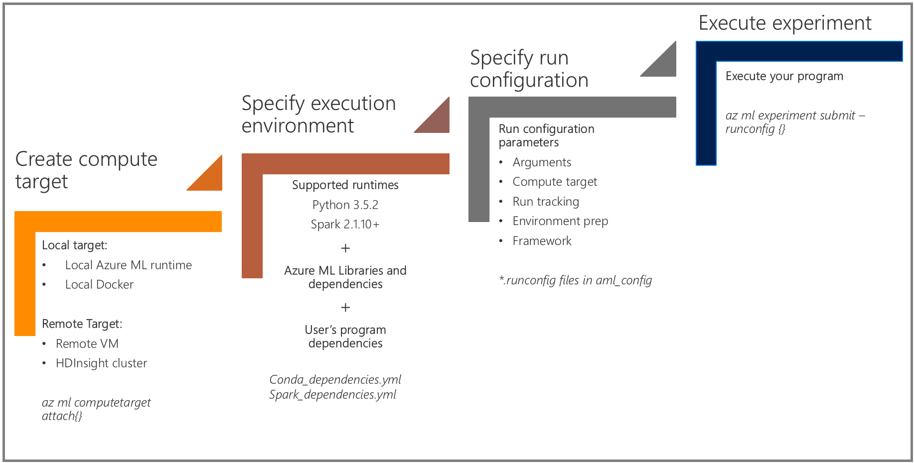
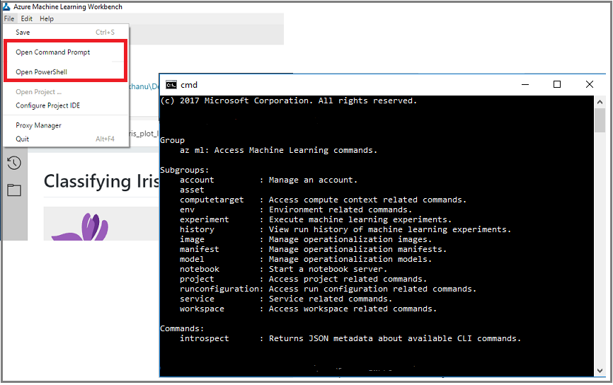
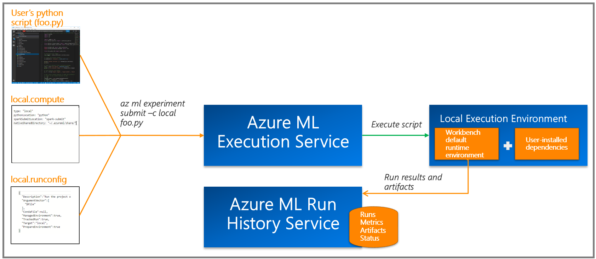
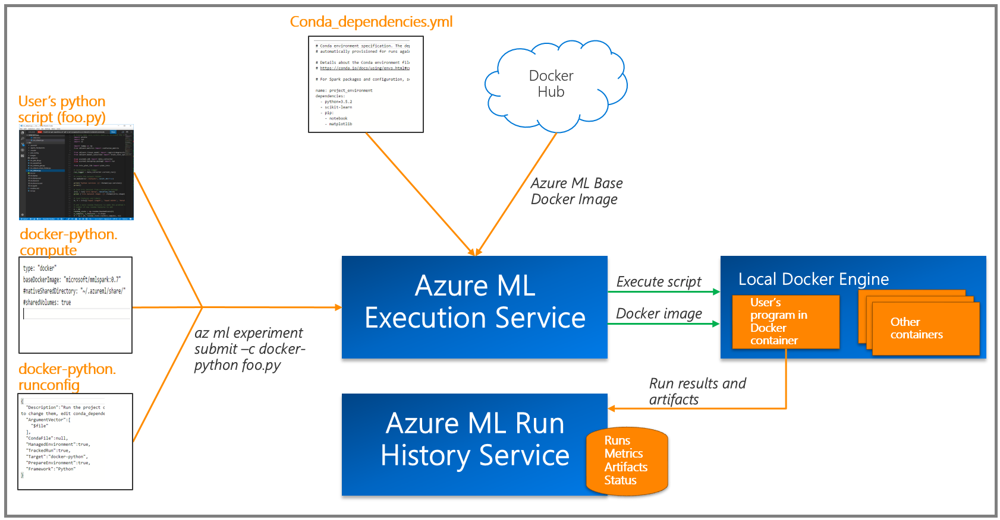
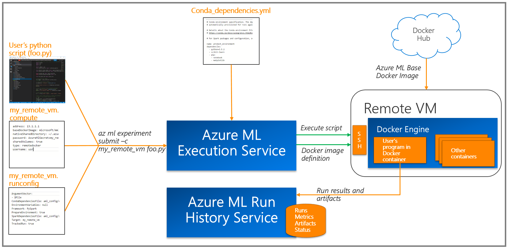
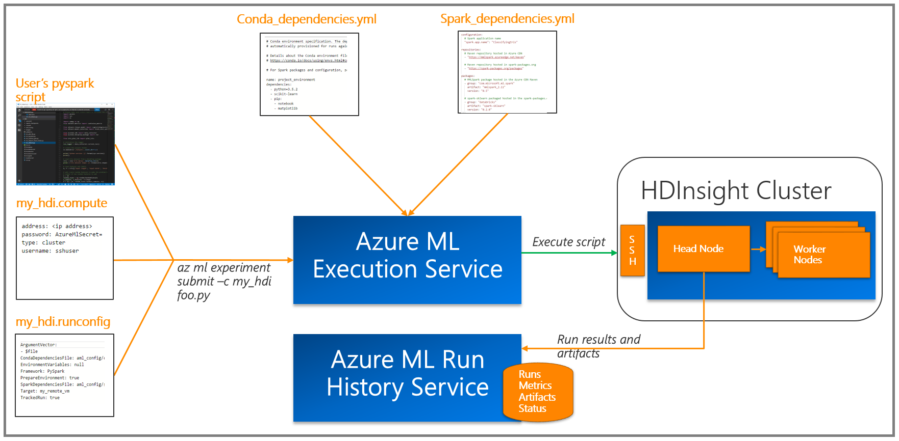

# Configuring Azure Machine Learning Experimentation Service

## Overview
Azure Machine Learning Experimentation Service enables data scientists to execute their experiments using the Azure Machine Learning execution and run management capabilities. It provides a framework for agile experimentation with fast iterations. Azure Machine Learning Workbench allows you to start with local runs on your machine and provides an easy path for scaling up and out to other environments such as remote Data Science VMs with GPU or HDInsight Clusters running Spark.

Experimentation Service is built for providing isolated, reproducible, and consistent runs of your experiments. It helps you manage your compute targets, execution environments, and run configurations. By using the Azure Machine Learning Workbench execution and run management capabilities, you can easily move  between different environments. 

You can execute a Python or PySpark script in a Workbench project locally or at scale in the cloud. 

You can run your scripts on: 

* Python (3.5.2) environment on your local computer installed by Workbench.
* Conda Python environment inside of a Docker container on local computer
* Conda Python environment inside of a Docker container on a remote Linux machine. For example, an [Ubuntu-based DSVM on Azure](https://azuremarketplace.microsoft.com/marketplace/apps/microsoft-ads.linux-data-science-vm-ubuntu)
* [HDInsight for Spark](https://azure.microsoft.com/services/hdinsight/apache-spark/) on Azure

>[!IMPORTANT]
>Azure Machine Learning Experimentation Service currently supports Python 3.5.2 and Spark 2.1.11 as Python and Spark runtime versions, respectively. 


### Key concepts in Experimentation Service
It is important to understand the following concepts in Azure Machine Learning experiment execution. In the subsequent sections, we discuss how to use these concepts in detail. 

#### Compute target
A _compute target_ specifies where to execute your program such as your desktop, remote Docker on a VM, or a cluster. A compute target needs to be addressable and accessible by you. Workbench gives you the ability to create compute targets and manage them using the Workbench application and the CLI. 

_az ml computetarget attach_ command in CLI enables you to create a compute target that you can use in your runs.

Supported compute targets are:
* Local Python (3.5.2) environment on your computer installed by Workbench.
* Local Docker on your computer
* Remote Docker on Linux-Ubuntu VMs. For example, an [Ubuntu-based DSVM on Azure](https://azuremarketplace.microsoft.com/marketplace/apps/microsoft-ads.linux-data-science-vm-ubuntu)
* [HDInsight for Spark cluster](https://azure.microsoft.com/services/hdinsight/apache-spark/) on Azure

Experimentation Service currently supports Python 3.5.2 and Spark 2.1.11 as Python and Spark runtime versions, respectively. 

>[!IMPORTANT]
> Windows VMs running Docker are **not** supported as remote compute targets.

#### Execution environment
The _execution environment_ defines the run time configuration and the dependencies needed to run the program in Workbench.

You manage the local execution environment using your favorite tools and package managers if you're running on the Workbench default runtime. 

Conda is used to manage local Docker and remote Docker executions as well as HDInsight-based executions. For these compute targets, the execution environment configuration is managed through **Conda_dependencies.yml** and **Spark_dependencies.yml files**. These files are in the **aml_config** folder inside your project.

**Supported runtimes for execution environments are:**
* Python 3.5.2
* Spark 2.1.11

### Run configuration
In addition to the compute target and execution environment, Azure Machine Learning provides a framework to define and change *run configurations*. Different executions of your experiment may require different configuration as part of iterative experimentation. You may be sweeping different parameter ranges, using different data sources, and tuning spark parameters. Experimentation Service provides a framework for managing run configurations.

Running _az ml computetarget attach_ command produces two files in your **aml_config** folder in your project: a .compute and  a .runconfig following this convention: _<your_computetarget_name>.compute_ and _<your_computetarget_name>.runconfig_. The .runconfig file is automatically created for your convenience when you create a compute target. You can create and manage other run configurations using _az ml runconfigurations_ command in CLI. You can also create and edit them on your file system.

Run configuration in Workbench also enables you to specify environment variables. You can specify environment variables and use them in your code by adding the following section in your .runconfig file. 

```
EnvironmentVariables:
"EXAMPLE_ENV_VAR1": "Example Value1"
"EXAMPLE_ENV_VAR2": "Example Value2"
```

These environment variables can be accessed in your code. For example, this phyton code snippet prints the environment variable named "EXAMPLE_ENV_VAR1"
```
print(os.environ.get("EXAMPLE_ENV_VAR1"))
```

_**The following figure shows the high-level flow for initial experiment run.**_


## Experiment execution scenarios
In this section, we dive into execution scenarios and learn about how Azure Machine Learning runs experiments, specifically running an experiment locally, on a remote VM, and on an HDInsight Cluster. This section is a walkthrough starting from creating a compute target to executing your experiments.

>[!NOTE]
>For the rest of this article we are using the CLI (Command-line interface) commands to show the concepts and the capabilities. Capabilities described here can also be used from Workbench.

## Launching the CLI
An easy way to launch the CLI is opening a project in Workbench and navigating to **File-->Open Command Prompt**.



This command launches a terminal window in which you can enter commands to execute scripts in the current project folder. This terminal window is configured with the Python 3.5.2 environment, which is installed by Workbench.

>[!NOTE]
> When you execute any _az ml_ command from the command window, you need to be authenticated against Azure. CLI uses an independent authentication cache then the desktop app and so logging in to Workbench doesn't mean you are authenticated in your CLI environment. To authenticate, follow the steps below. Authentication token is cached locally for a period of time so you only need to repeat these steps when the token expires. When the token expires or if you are seeing authentication errors, execute the following commands:

```
# to authenticate 
$ az login

# to list subscriptions
$ az account list -o table

# to set current subscription to a particular subscription ID 
$ az account set -s <subscription_id>

# to verify your current Azure subscription
$ az account show
```

>[!NOTE] 
>When you run _az ml_ command within a project folder, make sure that the project belongs to an Azure Machine Learning Experimentation account on the _current_ Azure subscription. Otherwise you may encounter execution errors.


## Running scripts and experiments
With Workbench, you can execute your Python and PySpark scripts on various compute targets using the _az ml experiment submit_ command. This command requires a run configuration definition. 

Workbench creates a corresponding .runconfig file when you create a compute target, but you can create additional run configurations using _az ml runconfiguration  create_ command. You can also manually edit the run configuration files.

Run configurations show up as part of experiment run experience in Workbench. 

>[!NOTE]
>You can learn more about the run configuration file in the [Experiment Execution Configuration Reference](experimentation-service-configuration-reference.md) Section.

## Running a script locally on Workbench-installed runtime
Workbench enables you to run your scripts directly against the Workbench-installed Python 3.5.2 runtime. This default runtime is installed at Workbench set-up time and includes Azure Machine Learning libraries and dependencies. Run results and artifacts for local executions are still saved in Run History Service in the cloud.

Unlike Docker-based executions, this configuration is _not_ managed by Conda. You need to manually provision package dependencies for your local Workbench Python environment.

You can execute the following command to run your script locally in the Workbench-installed Python environment. 

```
$az ml experiment submit -c local myscript.py
```

You can find the path to the default Python environment by typing the following command in the Workbench CLI window.
```
$ conda env list
```

>[!NOTE]
>Running PySpark locally directly against local Spark environments is currently **not** supported. Workbench does support PySpark scripts running on local Docker. Azure Machine Learning base Docker image comes with Spark 2.1.11 pre-installed. 

_**Overview of local execution for a Python script:**_


## Running a script on local Docker
You can also run your projects on a Docker container on your local machine through Experimentation Service. Workbench provides a base Docker image that comes with Azure Machine Learning libraries and as well as Spark 2.1.11 runtime to make local Spark executions easy. Docker needs to be already running on the local machine.

For running your Python or PySpark script on local Docker, you can execute the following commands in CLI.

```
$az ml experiment submit -c docker myscript.py
```
or
```
az ml experiment submit --run-configuration docker myscript.py
```

The execution environment on local Docker is prepared using the Azure Machine Learning base Docker image. Workbench downloads this image when running for the first time and overlays it with packages specified in your conda_dependencies.yml file. This operation makes the initial run slower but subsequent runs are considerably faster thanks to Workbench reusing cached layers. 

>[!IMPORTANT]
>You need to run _az ml experiment prepare -c docker_ command first to prepare the Docker image for your first run. You can also set the **PrepareEnvironment** parameter to true in your docker.runconfig file. This action automatically prepares your environment as part of your run execution.  

>[!NOTE]
>If running a PySpark script on Spark, spark_dependencies.yml is also used in addition to conda_dependencies.yml.

Running your scripts on a Docker image gives you the following benefits:

1. It ensures that your script can be reliably executed in other execution environments. Running on a Docker container helps you discover and avoid any local references that may impact portability. 

2. It allows you to quickly test code on runtimes and frameworks that are complex to install and configure, such as Apache Spark, without having to install them yourself.


_**Overview of local Docker execution for a Python script:**_


## Running a script on a remote Docker
In some cases, resources available on your local machine may not be enough to train the desired model. In this situation, Experimentation Service allows an easy way to run your Python or PySpark scripts on more powerful VMs using remote Docker execution. 

Remote VM should satisfy the following requirements:
* Remote VM needs to be running Linux-Ubuntu and should be accessible through SSH. 
* Remote VM needs to have Docker running.

>[!IMPORTANT]
> Windows VMs running Docker is **not** supported as remote compute targets


You can use the following command to create both the compute target definition and run configuration for remote Docker-based executions.

```
az ml computetarget attach --name "remotevm" --address "remotevm_IP_address" --username "sshuser" --password "sshpassword" --type remotedocker
```

Once you configure the compute target, you can use the following command to run your script.
```
$ az ml experiment submit -c remotevm myscript.py
```
>[!NOTE]
>Keep in mind that execution environment is configured using the specifications in conda_dependencies.yml. spark_dependencies.yml is also used if PySpark framework is specified in .runconfig file. 

The Docker construction process for remote VMs is exactly the same as the process for local Docker runs so you should expect a similar execution experience.

>[!TIP]
>If you prefer to avoid the latency introduced by building the Docker image for your first run, you can use the following command to prepare the compute target before executing your script. az ml experiment prepare -c <remotedocker>


_**Overview of remote vm execution for a Python script:**_



## Running a script on an HDInsight cluster
HDInsight is a popular platform for big-data analytics supporting Apache Spark. Workbench enables experimentation on big data using HDInsight Spark clusters. 

>![NOTE] The HDInsight cluster must use Azure Blob as the primary storage. Using Azure Data Lake storage is not supported yet.

You can create a compute target and run configuration for an HDInsight Spark cluster using the following command:

```
$ az ml computetarget attach --name "myhdi" --address "<FQDN or IP address>" --username "sshuser" --password "sshpassword" --type cluster 
```

>[!NOTE]
>If you use FQDN instead of an IP address and your HDI Spark cluster is named _foo_, the SSH endpoint is on the driver node named _foo-ssh.azurehdinsight.net_. Don't forget the **-ssh** postfix in the server name when using FQDN for _--address_ parameter.


Once you have the compute context, you can run the following command to execute your PySpark script.

```
$ az ml experiment submit -c myhdi myscript.py
```

Workbench prepares and manages execution environment on HDInsight cluster using Conda. Configuration is managed by _conda_dependencies.yml_ and _spark_dependencies.yml_ configuration files. 

You need SSH access to the HDInsight cluster in order to execute experiments in this mode. 

>[!NOTE]
>Supported configuration is HDInsight Spark clusters running Linux (Ubuntu with Python/PySpark 3.5.2 and Spark 2.1.11).

_**Overview of HDInsight-based execution for a PySpark script**_



## Running a script on GPU
To run your scripts on GPU, you can follow the guidance in this article:[How to use GPU in Azure Machine Learning](how-to-use-gpu.md)


## Next steps
* [Create and Install Azure Machine Learning](quickstart-installation.md)
* [Model Management](model-management-overview.md)
