# Execution of data science projects

This document describes how developers can execute a data science project in a systematic, version controlled, and collaborative way within a project team by using the [Team Data Science Process](overview.md) (TDSP). The TDSP is a framework developed by Microsoft that provides a structured sequence of activities to execute cloud-based, predictive analytics solutions efficiently. For an outline of the personnel roles, and their associated tasks that are handled by a data science team standardizing on this process, see [Team Data Science Process roles and tasks](roles-tasks.md). 

This article includes instructions on how to: 

1. do **sprint planning** for work items involved in a project.  If you are unfamiliar with sprint planning, you can find details and general information [here](https://en.wikipedia.org/wiki/Sprint_(software_development) "here"). 
2. **add work items** to sprints.
3. **link the work items with coding activities** tracked by git.
4. do **code review**. 

> [!NOTE]
> The steps needed to set up a TDSP team environment using Visual Studio Team Services (VSTS) are outlined in the following set of instructions. They specify how to accomplish these tasks with VSTS because that is how to implement TDSP at Microsoft.  If you choose to use VSTS, items (3) and (4) in the previous list are benefits that you get naturally. If another code hosting platform is used for your group, the tasks that need to be completed by the team lead generally do not change. But the way to complete these tasks is going to be different. For example, the item in section six, **Link a work item with a git branch**, might not be as easy as it is on VSTS.
>
>

The following figure illustrates a typical sprint planning, coding, and source-control workflow involved in implementing a data science project:

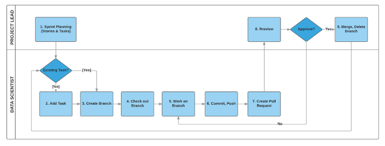

##  1. Terminology 

In the TDSP sprint planning framework, there are four frequently used types of **work items**: **Feature**, **User Story**, **Task**, and **Bug**. Each team project maintains a single backlog for all work items. There is no backlog at the git repository level under a team project. Here are their definitions:

- **Feature**: A feature corresponds to a project engagement. Different engagements with a client are considered different features. Similarly, it is best to consider different phases of a project with a client as different features. If you choose a schema such as ***ClientName-EngagementName*** to name your features, then you can easily recognize the context of the project/engagement from the names themselves.
- **Story**: Stories are different work items that are needed to complete a feature (project) end-to-end. Examples of stories include:
	- Getting Data 
	- Exploring Data 
	- Generating Features
	- Building Models
	- Operationalizing Models 
	- Retraining Models
- **Task**: Tasks are assignable code or document work items or other activities that need to be done to complete a specific story. For example, tasks in the story *Getting Data* could be:
	-  Getting Credentials of SQL Server 
	-  Uploading Data to SQL Data Warehouse. 
- **Bug**: Bugs usually refer to fixes that are needed for an existing code or document that are done when completing a task. If the bug is caused by missing stages or tasks respectively, it can escalate to being a story or a task. 

> [!NOTE]
> Concepts are borrowed of features, stories, tasks, and bugs from software code management (SCM) to be used in data science. They might differ slightly from their conventional SCM definitions.
>
>

Data scientists may feel more comfortable using an Agile template that specifically aligns with the TDSP lifecycle stages. With that in mind, an Agile-derived sprint planning template has been created, where Epics, Stories etc. are replaced by TDSP lifecycle stages or substages. Documentation on how to create such an Agile template can be found [here](https://msdata.visualstudio.com/AlgorithmsAndDataScience/TDSP/_git/TDSP?path=%2FDocs%2Fteam-data-science-process-agile-template.md&version=GBxibingao&_a=preview).

##  2. Sprint planning 

Sprint planning is useful for project prioritization, and resource planning and allocation. Many data scientists are engaged with multiple projects, each of which can take months to complete. Projects often proceed at different paces. On the VSTS server, you can easily create, manage, and track work items in your team project and conduct sprint planning to ensure that your projects are moving forward as expected. 

Follow [this link](https://www.visualstudio.com/en-us/docs/work/scrum/sprint-planning) for the step-by-step instructions on sprint planning in VSTS. 

##  3. Add a Feature  

After your project repository is created under a team project, go to the team **Overview** page and click **Manage work**.

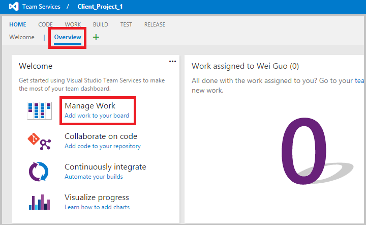

To include a feature in the backlog, click **Backlogs** --> **Features** --> **New**, type in the feature **Title** (usually your project name), and then click **Add** .

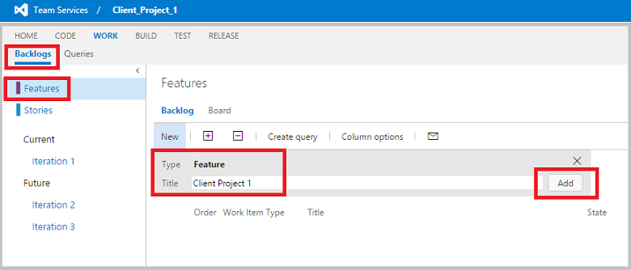

Double-click the feature you created. Fill in the descriptions, assign team members for this feature, and set planning parameters for this feature. 

You can also link this feature to the project repository. Click **Add link** under the **Development** section. After you have finished editing the feature, click **Save & Close** to exit.

##  4. Add Story under Feature 

Under the feature, stories can be added to describe major steps needed to finish the (feature) project. To add a new story, click the **+** sign to the left of the feature in backlog view.  

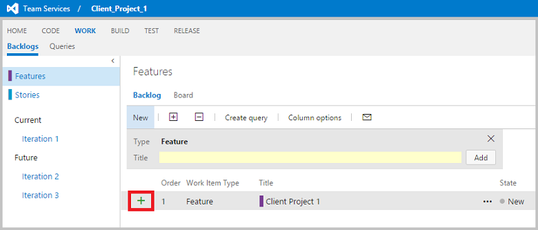

You can edit the details of the story, such as the status, description, comments, planning, and priority In the pop-up window.

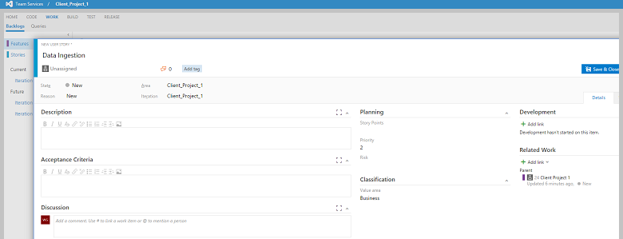

You can link this story to an existing repository by clicking **+ Add link** under **Development**. 

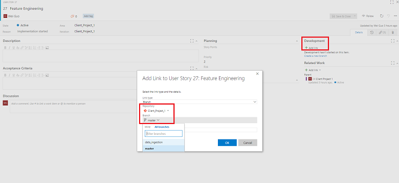

##  5. Add a task to a story 

Tasks are specific detailed steps that are needed to complete each story. After all tasks of a story are completed, the story should be completed too. 

To add a task to a story, click the **+** sign next to the story item, select **Task**, and then fill in the detailed information of this task in the pop-up window.

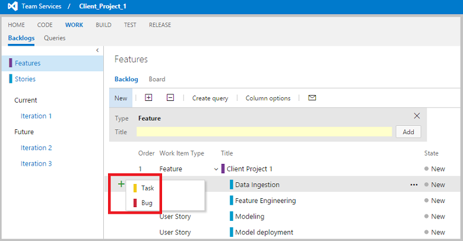

After the features, stories, and tasks are created, you can view them in the **Backlog** or **Board** views to track their status.

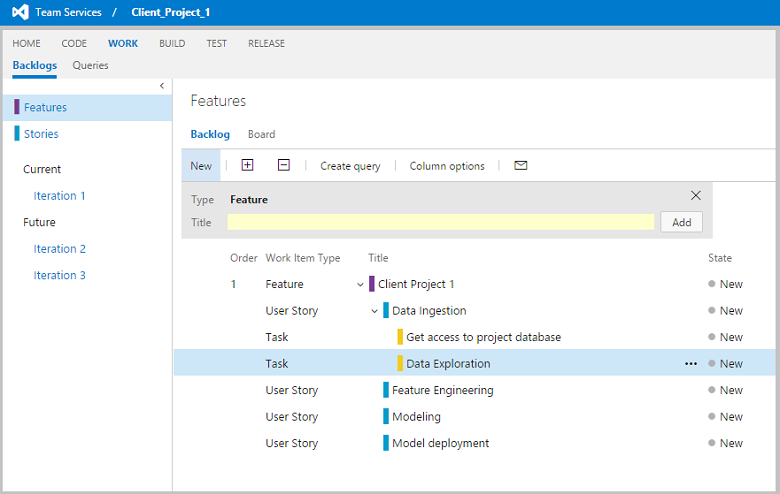

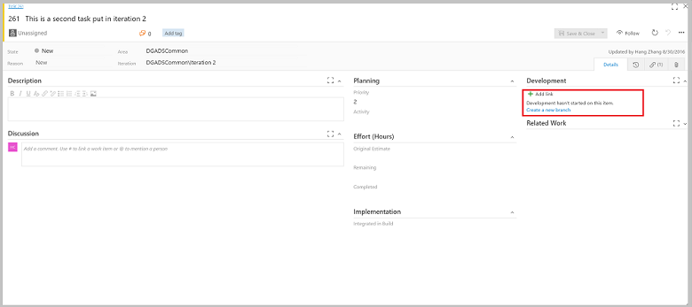

##  6. Link a work item with a git branch 

VSTS provides a convenient way to connect a work item (a story or task) with a git branch. This enables you to link your story or task directly to the code associated with it. 

To connect a work item to a new branch, double-click a work item, and in the pop-up window, click **Create a new branch** under **+ Add link**.  

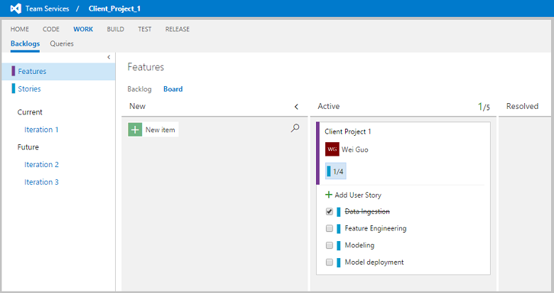

Provide the information for this new branch, such as the branch name, base git repository and the branch. The git repository  chosen must be the repository under the same team project that the work item belongs to. The base branch can be the master branch or some other existing branch.

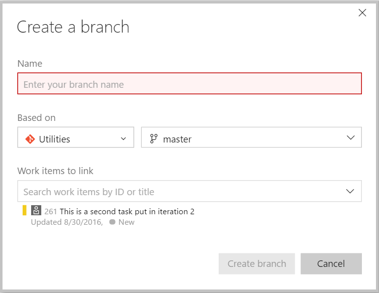

A good practice is to create a git branch for each story work item. Then, for each task work item, you create a branch based on the story branch. Organizing the branches in this hierarchical way that corresponds to the story-task relationships is helpful when you have multiple people working on different stories of the same project, or you have multiple people working on different tasks of the same story. Conflicts can be minimized when each team member works on a different branch and when each member works on different codes or other artifacts when sharing a branch. 

The following picture depicts the recommended branching strategy for TDSP. You might not need as many branches as are shown here, especially when you only have one or two people working on the same project, or only one person works on all tasks of a story. But separating the development branch from the master branch is always a good practice. This can help prevent the release branch from being interrupted by the development activities. More complete description of git branch model can be found in [A Successful Git Branching Model](http://nvie.com/posts/a-successful-git-branching-model/).

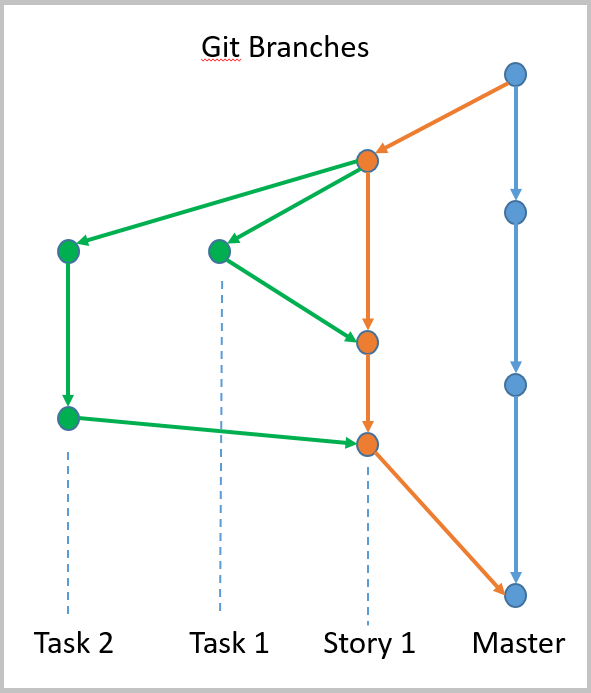

To switch to the branch that you want to work on, run the following command in a shell command (Windows or Linux). 

	git checkout <branch name>

Changing the *<branch name\>* to **master** switches you back to the **master** branch. After you switch to the working branch, you can start working on that work item, developing the code or documentation artifacts needed to complete the item. 

You can also link a work item to an existing branch. In the **Detail** page of a work item, instead of clicking **Create a new branch**, you click **+ Add link**. Then, select the branch you want to link the work item to. 

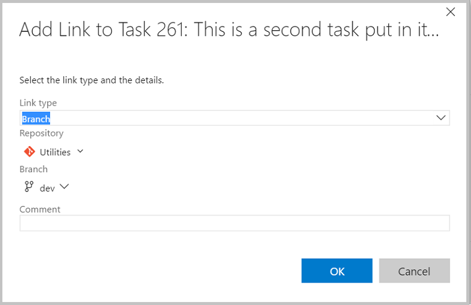

You can also create a new branch in git bash commands. If <base branch name\> is missing, the <new branch name\> is based on _master_ branch. 
	
	git checkout -b <new branch name> <base branch name>

##  7. Work on a branch and commit the changes 

Now suppose you make some change to the *data\_ingestion* branch for the work item, such as adding an R file on the branch in your local machine. You can commit the R file added to the branch for this work item, provided you are in that branch in your Git shell, using the following Git commands:

	git status
	git add .
	git commit -m"added a R scripts"
	git push origin data_ingestion

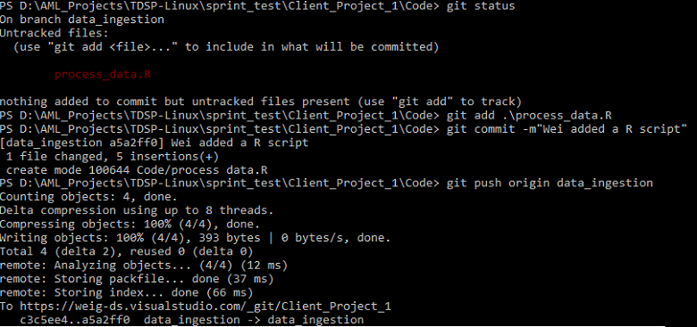

##  8. Create a pull request on VSTS 

When you are ready after a few commits and pushes, to merge the current branch into its base branch, you can submit a **pull request** on VSTS server. 

Go to the main page of your team project and click **CODE**. Select the branch to be merged and the git repository name that you want to merge the branch into. Then click **Pull Requests**, click **New pull request** to create a pull request review before the work on the branch is merged to its base branch.

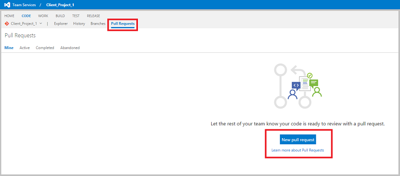

Fill in some description about this pull request, add reviewers, and send it out.

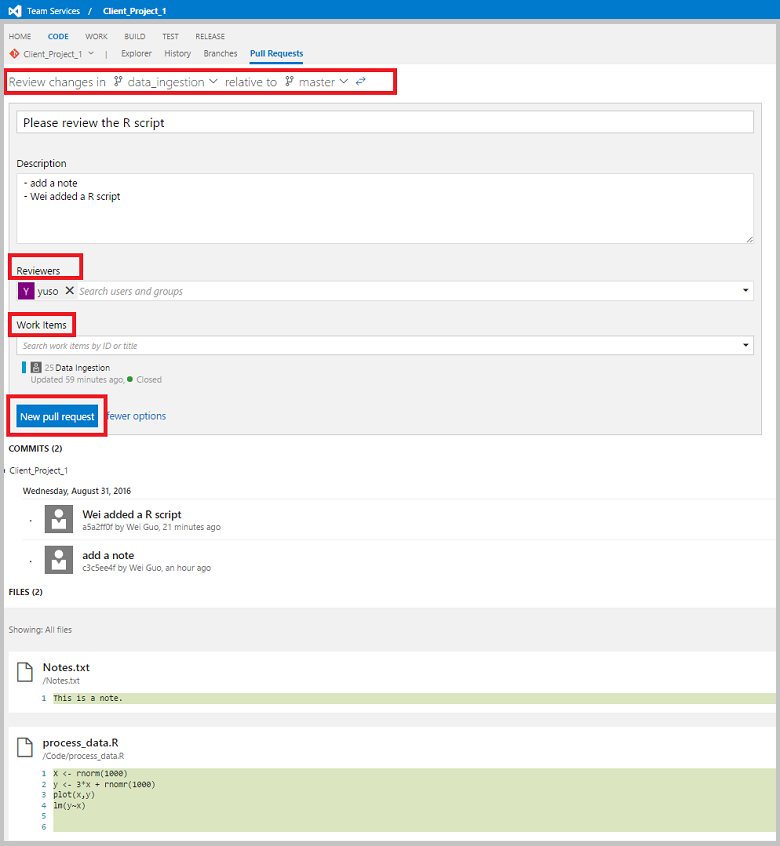

##  9. Review and merge 

When the pull request is created, your reviewers get an email notification to review the pull requests. The reviewers need to check whether the changes are working or not and test the changes with the requester if possible. Based on their assessment, the reviewers can approve or reject the pull request. 

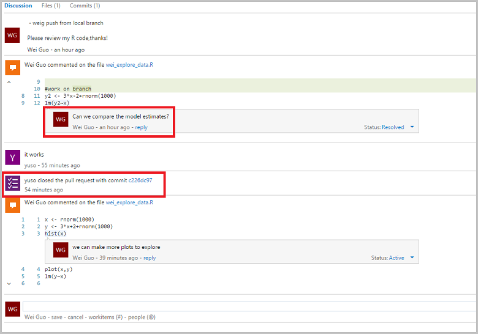

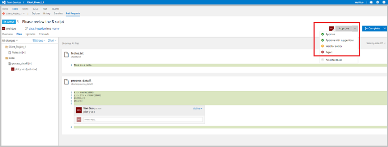

After the review is done, the working branch is merged to its base branch by clicking the **Complete** button. You may choose to delete the working branch after it has merged. 

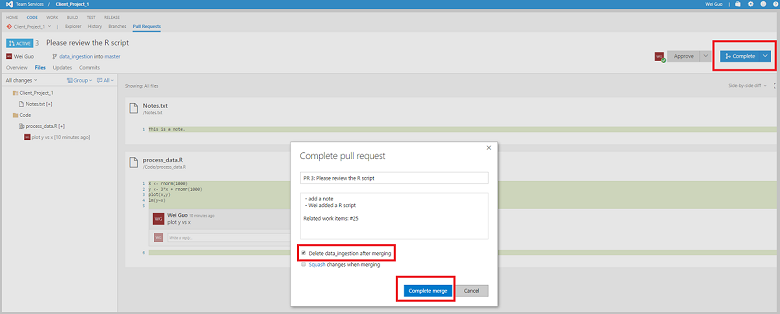

Confirm on the top left corner that the request is marked as **COMPLETED**. 

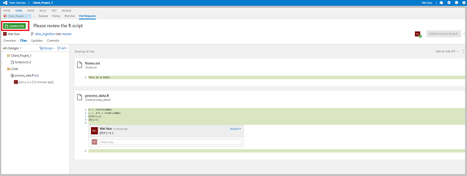

When you go back to the repository under **CODE**, you are told that you have been switched to the master branch.

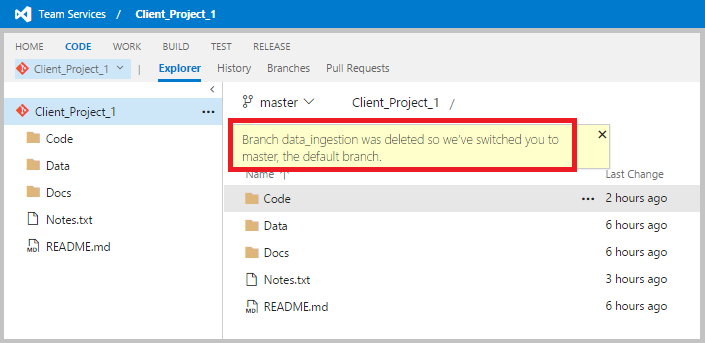

You can also use the following Git commands to merge your working branch to its base branch and delete the working branch after merging:

	git checkout master
	git merge data_ingestion
	git branch -d data_ingestion

##  10. Interactive Data Exploration, Analysis, and Reporting (IDEAR) Utility

This R markdown-based utility provides a flexible and interactive tool to evaluate and explore data sets. Users can quickly generate reports from the data set with minimal coding. Users can click buttons to export the exploration results in the interactive tool to a final report, which can be delivered to clients or used to make decisions on which variables to include in the subsequent modeling step.

At this time, the tool only works on data-frames in memory. A .yaml file is needed to specify the parameters of the data-set to be explored. For more information, see [IDEAR in TDSP Data Science Utilities](https://github.com/Azure/Azure-TDSP-Utilities/tree/master/DataScienceUtilities/DataReport-Utils).

##  11. Baseline Modeling and Reporting Utility

This utility provides a customizable, semi-automated tool to perform model creation with hyper-parameter sweeping, to and compare the accuracy of those models. 

The model creation utility is an R markdown file that can be run to produce self-contained html output with a table of contents for easy navigation through its different sections. Three algorithms are executed when the markdown file is run (knit): regularized regression using the glmnet package, random forest using the randomForest package, and boosting trees using the xgboost package). Each of these algorithms produces a trained model. The accuracy of these models is then compared and the relative feature importance plots are reported. Currently, there are two utilities: one is for a binary classification task and one is for a regression task. The primary differences between them is the way control parameters and accuracy metrics are specified for these learning tasks. 

A Yaml file is used to specify:

- the data input (a SQL source or an R-Data file) 
- what portion of the data is used for training and what portion for testing
- which algorithms to run 
- the choice of control parameters for model optimization:
	- cross-validation 
	- bootstrapping
	- folds of cross-validation
- the hyper-parameter sets for each algorithm. 

The number of algorithms, the number of folds for optimization, the hyper-parameters, and the number of hyper-parameter sets to sweep over can also be modified in the Yaml file to run the models quickly. For example, they can be run with a lower number of CV folds, a lower number of parameter sets. They can also be run more comprehensively with a higher number of CV folds or a larger number of parameter sets, if that is warranted.

For more information, see [Automated Modeling and Reporting Utility in TDSP Data Science Utilities](https://github.com/Azure/Azure-TDSP-Utilities/tree/master/DataScienceUtilities/Modeling).

##  12. Tracking progress of projects with Power BI dashboards

Data science group managers, team leads, and project leads need to track the progress of their projects, what work has been done on them and by whom, and remains on the to-do lists. If you are using VSTS, you are able to build Power BI dashboards to track the activities and the work items associated with a Git repository. For more information on how to connect Power BI to Visual Studio Team Services, see [Connect Power BI to Team Services](https://www.visualstudio.com/en-us/docs/report/powerbi/connect-vso-pbi-vs). 

To learn how to create Power BI dashboards and reports to track your Git repository activities and your work items after the data of VSTS is connected to Power BI, see [Create Power BI dashboards and reports](https://www.visualstudio.com/en-us/docs/report/powerbi/report-on-vso-with-power-bi-vs). 

Here are two simple example dashboards that are built to track Git activities and work items. In the first example dashboard, the git commitment activities are listed by different users, on different dates, and on different repositories. You can easily slice and dice to filter the ones that you are interested in.

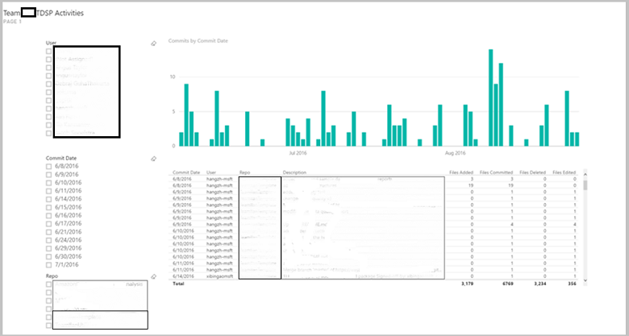

In the second example dashboard, the work items (stories and tasks) in different iterations are presented. They are grouped by assignees and priority levels, and colored by state.

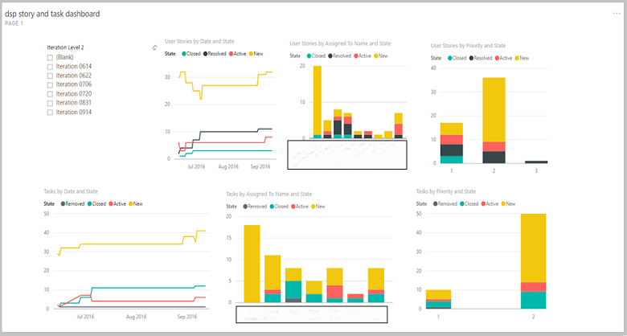

 
## Next steps

Full end-to-end walkthroughs that demonstrate all the steps in the process for **specific scenarios** are also provided. They are listed and linked with thumbnail descriptions in the [Example walkthroughs](walkthroughs.md) article. They illustrate how to combine cloud, on-premises tools, and services into a workflow or pipeline to create an intelligent application. 

For examples executing steps in the Team Data Science Process that use Azure Machine Learning Studio, see the [With Azure ML](http://aka.ms/datascienceprocess) learning path.