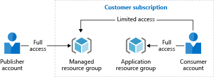

# Azure managed applications overview

Azure managed applications enable you to offer cloud solutions that are easy for consumers to deploy and operate. You implement the infrastructure and provide ongoing support. To make a managed application available to all customers, publish it in the Azure marketplace. To make it available to only users in your organization, publish it to an internal catalog. 

A managed application is similar to a solution template in the Marketplace, with one key difference. In a managed application, the resources are provisioned to a resource group that's managed by the publisher of the app. The resource group is present in the consumer's subscription, but an identity in the publisher's tenant has access to the resource group. As the publisher, you specify the cost for ongoing support of the solution.

## Advantages of managed applications

Managed applications reduce barriers to consumers using your solutions. They do not need expertise in cloud infrastructure to use your solution. Consumers have limited access to the critical resources. They do not need to worry about making a mistake when managing it. 

Managed applications enable you to establish an ongoing relationship with your consumers. You define terms for managing the application, and all charges are handled through Azure billing.

Although customers deploy these managed applications in their subscriptions, they don't have to maintain, update, or service them. You can ensure that all customers are using approved versions. Customers don't have to develop application-specific domain knowledge to manage these applications. Customers automatically acquire application updates without the need to worry about troubleshooting and diagnosing issues with the applications. 

For IT teams, managed applications enable you to offer pre-approved solutions to users in the organization. You ensure these solutions are compliant with organizational standards.

## Types of managed applications

You can publish your managed application either externally or internally.

### Service catalog

The service catalog is an internal catalog of approved solutions for users in an organization. You use the catalog to ensure compliance with certain organizational standards while they providing solutions for the organizations. Employees use the catalog to easily discover the rich set of applications that are recommended and approved by their IT departments. They see the managed applications that other people in their organization share with them.

For information about publishing a Service Catalog managed application, see [Create service catalog application](publish-service-catalog-app.md).

### Marketplace

Vendors wishing to bill for their services can make a managed application available through the Azure marketplace. After the vendor publishes an application, it's available to users outside the organization. With this approach, managed service providers (MSPs), independent software vendors (ISVs), and system integrators (SIs) can offer their solutions to all Azure customers.

For information about publishing a managed application to the Marketplace, see [Create marketplace application](publish-marketplace-app.md).

## Resource groups for managed applications

Typically, the resources for a managed application reside in two resource groups. The consumer manages one resource group, and the publisher manages the other resource group. When defining the managed application, the publisher specifies the levels of access. The following image shows a scenario where the publisher requests the owner role for the managed resource group. The publisher placed a read-only lock on this resource group for the consumer.

### Application resource group

This resource group holds the managed application instance. This resource group may only contain one resource. The resource type of the managed application is **Microsoft.Solutions/applications**.

The consumer has full access to the resource group and uses it to manage the lifecycle of the managed application.

### Managed resource group

This resource group holds all the resources that are required by the managed application. For example, this resource group contains the virtual machines, storage accounts, and virtual networks for the solution. The consumer has limited access to this resource group because the consumer does not manage the individual resources for the managed application. The publisher's access to this resource group corresponds to the role specified in the managed application definition. For example, the publisher might request the Owner or Contributor role for this resource group.

When the consumer deletes the managed application, the managed resource group is also deleted.

## Next steps

* For an introduction to defining and deploying a managed application, see [Create and deploy an Azure managed application with Azure CLI](managed-apps-quickstart-cli.md)
* For information about publishing an internal application, see [Create service catalog application](publish-service-catalog-app.md).
* For information about publishing managed applications to the marketplace, see [Create marketplace application](publish-marketplace-app.md).

