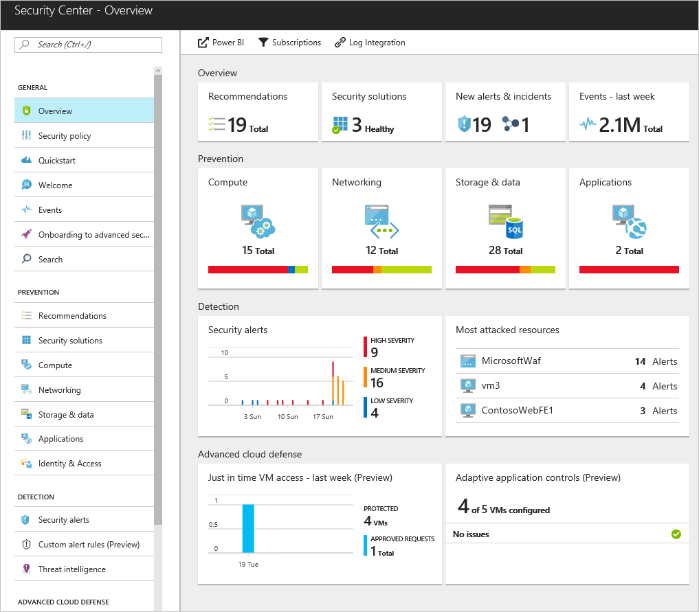

# Introduction to Azure Security Center
Learn about Azure Security Center, its key capabilities, and how it works.

## What is Azure Security Center?
Azure Security Center provides unified security management and advanced threat protection for workloads running in Azure, on-premises, and in other clouds.  It delivers visibility and control over hybrid cloud workloads, active defenses that reduce your exposure to threats, and intelligent detection to help you keep pace with rapidly evolving cyberattacks.

The Security Center Overview provides a quick view into the security posture of your Azure and non-Azure workloads, enabling you to discover and assess the security of your workloads and to identify and mitigate risk.

## Why use Security Center?

**Unified visibility and control**

- **Understand security state across hybrid workloads**. Manage security across all your hybrid cloud workloads – on-premises, Azure, and other cloud platforms – in one console. Built-in dashboards provide instant insights into security issues that require attention.
- **Visibility into cloud workloads**. Keep pace with rapidly changing cloud workloads. Automatically discover and onboard new resources created in your Azure subscriptions.
- **Centralized policy management**. Ensure compliance with company or regulatory security requirements by centrally managing security policies across all your hybrid cloud workloads.
- **Security data from many sources**. Collect, search, and analyze security data from a variety of sources, including connected partner solutions like network firewalls and other Microsoft services. 
- **Integration with existing security workflows**. Access, integrate, and analyze security information using REST APIs to connect existing tools and processes.
- **Compliance reporting**. Use security data and insights to demonstrate compliance and easily generate evidence for auditors.

**Adaptive threat prevention**

- **Continuous security assessment**. Monitor the security of machines, networks, and Azure services using hundreds of built-in security assessments or create your own. Identify software and configurations that are vulnerable to attack.
- **Actionable recommendations**. Remediate security vulnerabilities before they can be exploited by attackers with prioritized, actionable security recommendations and built-in automation playbooks.
- **Adaptive application controls**. Block malware and other unwanted applications by applying whitelisting recommendations adapted to your specific Azure workloads and powered by machine learning. 
- **Network access security**. Reduce the network attack surface with just-in-time, controlled access to management ports on Azure VMs, drastically reducing exposure to brute force and other network attacks.

**Intelligent threat detection and response**

- **Industry’s most extensive threat intelligence**. Tap into the Microsoft Intelligent Security Graph, which uses trillions of signals from Microsoft services and systems around the globe to identify new and evolving threats.
- **Advanced threat detection**. Use built-in behavioral analytics and machine learning to identify attacks and zero-day exploits. Monitor networks, machines, and cloud services for incoming attacks and post-breach activity.
- **Prioritized alerts and Incidents**. Focus on the most critical threats first with prioritized security alerts and incidents that map alerts of different types into a single attack campaign. Create your own custom security alerts as well.
- **Streamlined investigation**. Quickly assess the scope and impact of an attack with a visual, interactive experience. Use predefined or ad hoc queries for deeper exploration of security data. 
- **Contextual threat intelligence**. Visualize the source of attacks on an interactive world map. Use built-in threat intelligence reports to gain valuable insight into the techniques and objectives of known malicious actors.

## Get started
To get started with Security Center, you need a subscription to Microsoft Azure. Security Center is enabled with your Azure subscription. If you do not have a subscription, you can sign up for a [free trial](https://azure.microsoft.com/pricing/free-trial/). 

[Getting started with Azure Security Center](https://docs.microsoft.com/azure/security-center/security-center-get-started) quickly guides you through the security-monitoring and policy-management components of Security Center. 

## Next steps
In this document, you were introduced to Security Center, its key capabilities, and how to get started. To learn more, see the following resources:

* [Azure Security Center planning and operations guide](security-center-planning-and-operations-guide.md) — Learn how to optimize your use of Security Center based on your organization’s security requirements and cloud management model.
* [Setting security policies](https://docs.microsoft.com/azure/security-center/security-center-policies)  — Learn how to configure security policies for your Azure subscriptions and resource groups.
* [Managing security recommendations](https://docs.microsoft.com/azure/security-center/security-center-recommendations)  — Learn how recommendations help you protect your Azure and non-Azure resources.
* [Security health monitoring](https://docs.microsoft.com/azure/security-center/security-center-monitoring)  — Learn how to monitor the health of your Azure and non-Azure resources.
* [Managing and responding to security alerts](https://docs.microsoft.com/azure/security-center/security-center-managing-and-responding-alerts)  — Learn how to manage and respond to security alerts.
* [Monitoring partner solutions](https://docs.microsoft.com/azure/security-center/security-center-partner-solutions)  — Learn how to monitor the health status of your partner solutions.
* [Security Center FAQ](https://docs.microsoft.com/azure/security-center/security-center-faq) — Find frequently asked questions about using Security Center.

