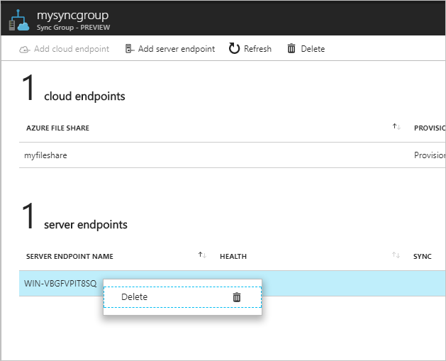

# Add/remove an Azure File Sync (preview) Server Endpoint
Azure File Sync (preview) allows you to centralize your organization's file shares in Azure Files without giving up the flexibility, performance, and compatibility of an on-premises file server. It does this by transforming your Windows Servers into a quick cache of your Azure File share. You can use any protocol available on Windows Server to access your data locally (including SMB, NFS, and FTPS) and you can have as many caches as you need across the world.

A *Server Endpoint* represents a specific location on a *Registered Server*, such as a folder on a server volume or the root of the volume. Multiple Server Endpoints can exist on the same volume if their namespaces are not overlapping (for example, F:\sync1 and F:\sync2). You can configure cloud tiering policies individually for each Server Endpoint. If you add a server location with an existing set of files as a Server Endpoint to a Sync Group, those files will be merged with any other files already on other endpoints in the Sync Group.

See [How to deploy Azure File Sync (preview)](storage-sync-files-deployment-guide.md) for information on how to deploy Azure File Sync end-to-end.

## Prerequisites
To create a Server Endpoint, you must first ensure that the following criteria are met: 
- The server has the Azure File Sync agent installed and has been registered. Instructions for installing the Azure File Sync Agent can be found in the [Register/unregister a server with Azure File Sync (preview)](storage-sync-files-server-registration.md) article. 
- Ensure that a Storage Sync Service has been deployed. See [How to deploy Azure File Sync (preview)](storage-sync-files-deployment-guide.md) for details on how to deploy a Storage Sync Service. 
- Ensure that a Sync Group has been deployed. Learn how to [Create a Sync Group](storage-sync-files-deployment-guide.md#create-a-sync-group).
- Ensure that the server is connected to the internet and that Azure is accessible.

## Add a Server Endpoint
To add a Server Endpoint, navigate to the desired Sync Group, and select "Add server endpoint".


The following information is required under **Add server endpoint**:

- **Registered Server**: The name of the server or cluster to create the Server Endpoint on.
- **Path**: The path on the Windows Server to be synchronized as part of the Sync Group.
- **Cloud Tiering**: A switch to enable or disable cloud tiering, which enables infrequently used or access files to be tiered to Azure Files.
- **Volume Free Space**: the amount of free space to reserve on the volume which the Server Endpoint resides. For example, if the volume free space is set to 50% on a volume with a single Server Endpoint, roughly half the amount of data will be tiered to Azure Files. Regardless of whether cloud tiering is enabled, your Azure File share always has a complete copy of the data in the Sync Group.

Select **Create** to add the Server Endpoint. The files within a namespace of a Sync Group will now be kept in sync. 

## Remove a Server Endpoint
When enabled for a Server Endpoint, cloud tiering will *tier* files to your Azure File shares. This enables on-premises file shares to act as a cache, rather than a complete copy of the dataset, to make efficient use of the space on the file server. However, if a Server Endpoint is removed with tiered files still locally on the server, those files will become unaccessible. Therefore, if continued file access is desired, you must recall all tiered files from Azure Files before continuing with deregistration. 

This can be done with the PowerShell cmdlet as shown below:

```PowerShell
Import-Module "C:\Program Files\Azure\StorageSyncAgent\StorageSync.Management.ServerCmdlets.dll"
Invoke-StorageSyncFileRecall -Path <path-to-to-your-server-endpoint>
```

> [!Warning]  
> If the local volume hosting the server does not have enough free space to recall all the tiered data, the `Invoke-StorageSyncFileRecall` cmdlet fails.  

To remove the Server Endpoint:

1. Navigate to the Storage Sync Service where your server is registered.
2. Navigate to the desired Sync Group.
3. Remove the Server Endpoint you desire in the Sync Group in the Storage Sync Service. This can be accomplished by right-clicking the relevant Server Endpoint in the Sync Group pane.

    

## Next steps
- [Register/unregister a server with Azure File Sync (preview)](storage-sync-files-server-registration.md)
- [Planning for an Azure File Sync deployment](storage-sync-files-planning.md)