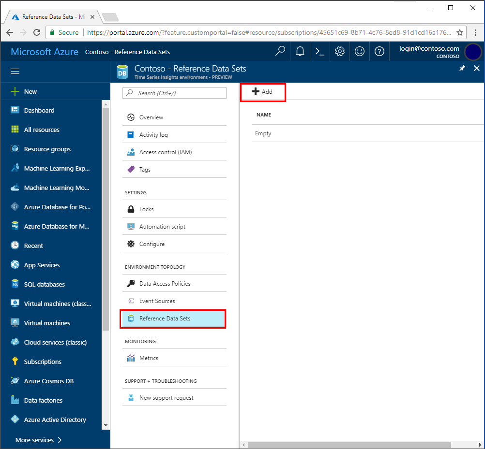
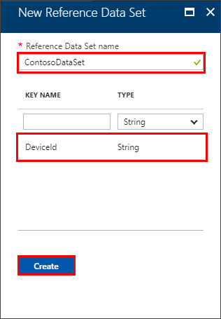

# Create a reference data set for your Time Series Insights environment using the Azure portal

This article describes how to add a reference data set to your Azure Time Series Insights environment. Reference data is useful to join to your source data to augment the values.

A Reference Data Set is a collection of items that are augmented with the events from your event source. Time Series Insights ingress engine joins an event from your event source with an item in your reference data set. This augmented event is then available for query. This join is based on the keys defined in your reference data set.

## Add a reference data set

1. Sign in to the [Azure portal](https://portal.azure.com).

2. Locate your existing Time Series Insights environment. Click **All resources** in the menu on the left side of the Azure portal. Select your Time Series Insights environment.

3. Under the **Environment Topology** heading, select **Reference Data Sets**.

    

4. Select **+ Add** to add a new reference data set.

5. Specify a unique **Reference Data Set name**.

    

6. Specify the **Key name** in the empty field and select its **Type**. This name and type are used to pick the correct property from the events in your event source for joining to the reference data. 

   For example, if you provide key name as **DeviceId** and type as **String**, then the Time Series Insights ingress engine looks for a property with the name **DeviceId** of type **String** in each incoming event to look up and join with. You can provide more than one key to join with the event. The key name match is case-sensitive.

7. Select **Create**.

## Next steps
* [Manage reference data](time-series-insights-manage-reference-data-csharp.md) programmatically.
* For the complete API reference, see [Reference Data API](/rest/api/time-series-insights/time-series-insights-reference-reference-data-api) document.
