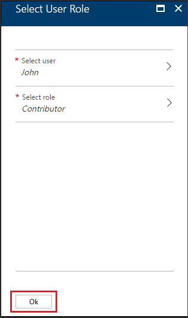

# Grant data access to a Time Series Insights environment using Azure portal

Time Series Insights environments have two independent types of access policies:

* Management access policies
* Data access policies

Both policies grant Azure Active Directory principals (users and apps) various permissions on a particular environment. The principals (users and apps) must belong to the active directory (known as the Azure tenant) associated with the subscription containing the environment.

Management access policies grant permissions related to the configuration of the environment, such as
*	Creation and deletion of the environment, event sources, reference data sets, and
*	Management of the data access policies.

Data access policies grant permissions to issue data queries, manipulate reference data in the environment, and share saved queries and perspectives associated with the environment.

The two kinds of policies allow clear separation between access to the management of the environment and access to the data inside the environment. For example, it is possible to set up an environment such that the owner/creator of the environment is removed from the data access. In addition, users and services that are allowed to read data from the environment may be granted no access to the configuration of the environment.

## Grant data access
Follow these steps to grant data access for a user principal:

1. Sign in to the [Azure portal](https://portal.azure.com).

2. Locate your Time Series Insights environment. Type **Time Series** in the **search** box. Select **Time Series Environment** in the search results. 

3. Select your Time Series Insights environment from the list.
   
4. Select **Data Access Policies**, then select **+ Add**.
  

5. Select **Select user**.  Search for the user name or email address to locate the user you want to add. Click **Select** to confirm the selection. 

   

6. Select **Select role**. Choose the appropriate access role for the user:
   - Select **Contributor** if you want to allow user to change reference data and share saved queries and perspectives with other users of the environment. 
   - Otherwise, select **Reader** to allow user query data in the environment and save personal (not shared) queries in the environment.

   Select **Ok** to confirm the role choice.

   

8. Select **Ok** in the **Select User Role** page.

   

9. The **Data Access Policies** page lists the users and the role(s) for each user.

   

## Next steps
* Learn [how to add an Event Hub event source to your Azure Time Series Insights environment](time-series-insights-how-to-add-an-event-source-eventhub.md).
* [Send events](time-series-insights-send-events.md) to the event source.
* View your environment in [Time Series Insights explorer](https://insights.timeseries.azure.com).
