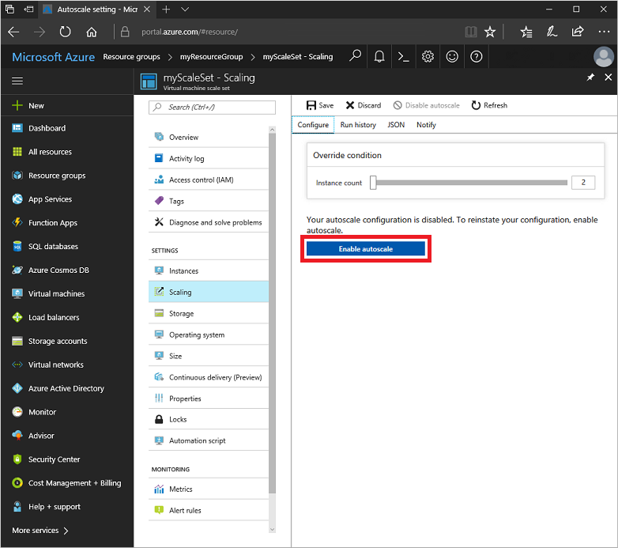
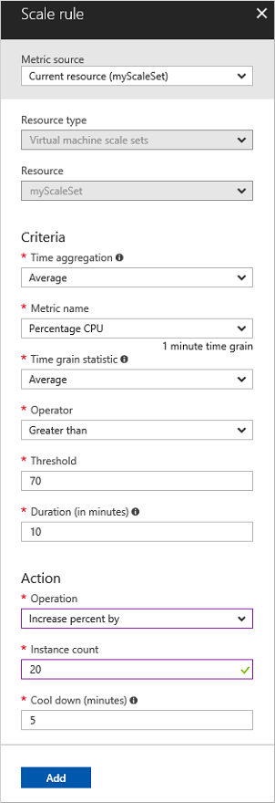
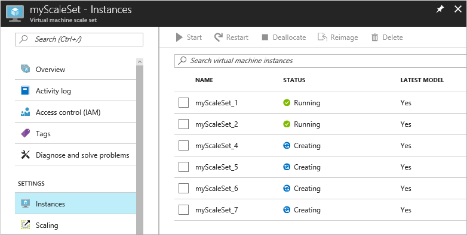

# Automatically scale a virtual machine scale set in the Azure portal
When you create a scale set, you define the number of VM instances that you wish to run. As your application demand changes, you can automatically increase or decrease the number of VM instances. The ability to autoscale lets you keep up with customer demand or respond to application performance changes throughout the lifecycle of your app.

This article shows you how to create autoscale rules in the Azure portal that monitor the performance of the VM instances in your scale set. These autoscale rules increase or decrease the number of VM instances in response to these performance metrics. You can also complete these steps with [Azure PowerShell](virtual-machine-scale-sets-autoscale-powershell.md) or the [Azure CLI 2.0](virtual-machine-scale-sets-autoscale-cli.md).

## Prerequisites
To create autoscale rules, you need an existing virtual machine scale set. You can create a scale set with the [Azure portal](virtual-machine-scale-sets-portal-create.md), [Azure PowerShell](virtual-machine-scale-sets-create.md#create-from-powershell), or [Azure CLI 2.0](virtual-machine-scale-sets-create.md#create-from-azure-cli).

## Create a rule to automatically scale out
If your application demand increases, the load on the VM instances in your scale set increases. If this increased load is consistent, rather than just a brief demand, you can configure autoscale rules to increase the number of VM instances in the scale set. When these VM instances are created and your applications are deployed, the scale set starts to distribute traffic to them through the load balancer. You control what metrics to monitor, such as CPU or disk, how long the application load must meet a given threshold, and how many VM instances to add to the scale set.

1. Open the Azure portal and select **Resource groups** from the menu on the left-hand side of the dashboard.
2. Select the resource group that contains your scale set, then choose your scale set from the list of resources.
3. Choose **Scaling** from the menu on the left-hand side of the scale set window. Select the button to **Enable autoscale**:

    

4. Enter a name for your settings, such as *autoscale*, then select the option to **Add a rule**.

5. Let's create a rule that increases the number of VM instances in a scale set when the average CPU load is greater than 70% over a 10-minute period. When the rule triggers, the number of VM instances is increased by 20%. In scale sets with a small number of VM instances, you could set the **Operation** to *Increase count by* and then specify *1* or *2* for the *Instance count*. In scale sets with a large number of VM instances, an increase of 10% or 20% VM instances may be more appropriate.

    Specify the following settings for your rule:
    
    | Parameter              | Explanation                                                                                                         | Value          |
    |------------------------|---------------------------------------------------------------------------------------------------------------------|----------------|
    | *Time Aggregation*     | Defines how the collected metrics should be aggregated for analysis.                                                | Average        |
    | *Metric Name*          | The performance metric to monitor and apply scale set actions on.                                                   | Percentage CPU |
    | *Time grain statistic* | Defines how the collected metrics in each time grain should be aggregated for analysis.                             | Average        |
    | *Operator*             | Operator used to compare the metric data against the threshold.                                                     | Greater than   |
    | *Threshold*            | The percentage that causes the autoscale rule to trigger an action.                                                 | 70             |
    | *Duration*             | The amount of time monitored before the metric and threshold values are compared.                                   | 10 minutes     |
    | *Operation*            | Defines if the scale set should scale up or down when the rule applies and by what increment                        | Increase percent by |
    | *Instance count*       | The percentage of VM instances should be changed when the rule triggers.                                            | 20             |
    | *Cool down (minutes)*  | The amount of time to wait before the rule is applied again so that the autoscale actions have time to take effect. | 5 minutes      |

    The following examples show a rule created in the Azure portal that matches these settings:    

    

6. To create the rule, select **Add**

## Create a rule to automatically scale in
On an evening or weekend, your application demand may decrease. If this decreased load is consistent over a period of time, you can configure autoscale rules to decrease the number of VM instances in the scale set. This scale-in action reduces the cost to run your scale set as you only run the number of instances required to meet the current demand.

1. Choose to **Add a rule** again.
2. Create a rule that decreases the number of VM instances in a scale set when the average CPU load then drops below 30% over a 10-minute period. When the rule triggers, the number of VM instances is decreased by 20%.

    Use the same approach as with the previous rule. Adjust the following settings for your rule:
    
    | Parameter              | Explanation                                                                                                          | Value          |
    |------------------------|----------------------------------------------------------------------------------------------------------------------|----------------|
    | *Operator*             | Operator used to compare the metric data against the threshold.                                                      | Less than   |
    | *Threshold*            | The percentage that causes the autoscale rule to trigger an action.                                                 | 30             |
    | *Operation*            | Defines if the scale set should scale up or down when the rule applies and by what increment                         | Decrease percent by |
    | *Instance count*       | The percentage of VM instances should be changed when the rule triggers.                                             | 20             |

3. To create the rule, select **Add**

## Define autoscale instance limits
Your autoscale profile must define a minimum, maximum, and default number of VM instances. When your autoscale rules are applied, these instance limits make sure that you do not scale out beyond the maximum number of instances, or scale in beyond the minimum of instances.

1. Set the following instance limits:

    | Minimum | Maximum | Default|
    |---------|---------|--------|
    | 2       | 10      | 2      |

2. To apply your autoscale rules and instance limits, select **Save**.

## Monitor number of instances in a scale set
To see the number and status of VM instances, select **Instances** from the menu on the left-hand side of the scale set window. The status indicates if the VM instance is *Creating* as the scale set automatically scales out, or is *Deleting* as the scale automatically scales in.

## Autoscale based on a schedule
The previous examples automatically scaled a scale set in or out with basic host metrics such as CPU usage. You can also create autoscale rules based on schedules. These schedule-based rules allow you to automatically scale out the number of VM instances ahead of an anticipated increase in application demand, such as core work hours, and then automatically scale in the number of instances at a time that you anticipate less demand, such as the weekend.

1. Choose **Scaling** from the menu on the left-hand side of the scale set window. To delete the existing autoscale rules created in the previous examples, choose the trash can icon.

    

2. Choose to **Add a scale condition**. Select the pencil icon next to rule name, and provide a name such as *Scale out during each work day*.

    

3. Select the radio button to **Scale to a specific instance count**.
4. To scale up the number of instances, enter *10* as the instance count.
5. Choose **Repeat specific days** for the **Schedule** type.
6. Select all the work days, Monday through Friday.
7. Choose the appropriate timezone, then specify a **Start time** of *09:00*.
8. Choose to **Add a scale condition** again. Repeat the process to create a schedule named *Scale in during the evening* that scales to *3* instances, repeats every weekday, and starts at *18:00*.
9. To apply your schedule-based autoscale rules, select **Save**.

    

To see how your autoscale rules are applied, select **Run history** across the top of the **Scaling** window. The graph and events list shows when the autoscale rules trigger and the number of VM instances in your scale increases or decreases.

## Next steps
In this article, you learned how to use autoscale rules to scale horizontally and increase or decrease the *number* of VM instances in your scale set. You can also scale vertically to increase or decrease the VM instance *size*. For more information, see [Vertical autoscale with Virtual Machine Scale sets](virtual-machine-scale-sets-vertical-scale-reprovision.md).

For information on how to manage your VM instances, see [Manage virtual machine scale sets with Azure PowerShell](virtual-machine-scale-sets-windows-manage.md).

To learn how to generate alerts when your autoscale rules trigger, see [Use autoscale actions to send email and webhook alert notifications in Azure Monitor](../monitoring-and-diagnostics/insights-autoscale-to-webhook-email.md). You can also [Use audit logs to send email and webhook alert notifications in Azure Monitor](../monitoring-and-diagnostics/insights-auditlog-to-webhook-email.md).
