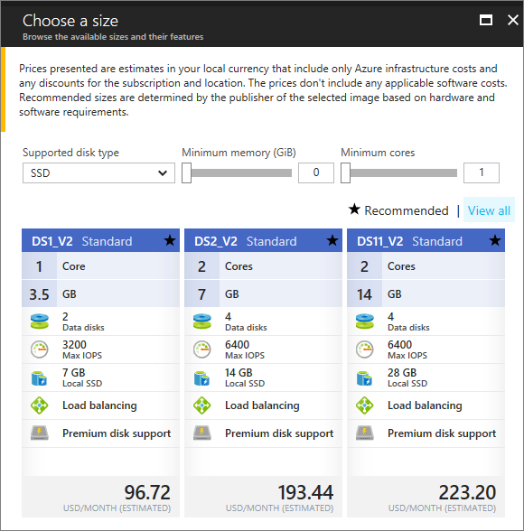
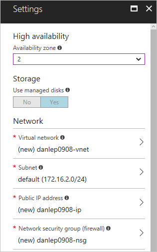

# Create a Windows virtual machine in an availability zone with the Azure portal

This article steps through using the Azure portal to create a virtual machine in an Azure availability zone. An [availability zone](../../availability-zones/az-overview.md) is a physically separate zone in an Azure region. Use availability zones to protect your apps and data from an unlikely failure or loss of an entire datacenter.

[!INCLUDE [availability-zones-preview-statement.md](../../../includes/availability-zones-preview-statement.md)]


## Log in to Azure 

Log in to the Azure portal at https://portal.azure.com.

## Create virtual machine

1. Click the **New** button found on the upper left-hand corner of the Azure portal.

2. Select **Compute**, and then select **Windows Server 2016 Datacenter**. 

3. Enter the virtual machine information. The user name and password entered here is used to log in to the virtual machine. When complete, click **OK**.

    

4. Select a size for the VM. To see more sizes, select **View all** or change the **Supported disk type** filter. Take care to select one of the sizes supported in the availability zones preview, such as *DS1_v2 Standard*. 

      

5. Under **Settings** > **High availability**, select one of the numbered zones from the **Availability zone** dropdown, keep the remaining defaults, and click **OK**.

    

6. On the summary page, click **Purchase** to start the virtual machine deployment.

7. The VM will be pinned to the Azure portal dashboard. Once the deployment has completed, the VM summary automatically opens.


## Zone for IP address and managed disk

When the VM is deployed in an availability zone, the IP address and managed disk resources are deployed in the same availability zone. You can confirm the zone settings using Azure PowerShell. If you need to install or upgrade, see [Install Azure PowerShell module](/powershell/azure/install-azurerm-ps).

The following examples get information about the resources in a resource group named *myResourceGroup*. Substitute the name of the resource group you used to create the VM.

Find the zone of the public IP address with [Get-AzureRmPublicIpAddress](/en-us/powershell/module/azurerm.network/get-azurermpublicipaddress):

```powershell
Get-AzureRmPublicIpAddress -ResourceGroupName myResourceGroup
```
The `Zones` setting in the output shows that the public IP address is in the same availability zone as the VM:

```powershell
Name                     : myVM-ip
ResourceGroupName        : myResourceGroup
Location                 : eastus2
Id                       : /subscriptions/e44f251c-c67e-4760-9ed6-bf99a306ecff/resourceGroups/danlep0911/providers/Micr
                           osoft.Network/publicIPAddresses/myVM-ip
Etag                     : W/"b67e14c0-7e8a-4d12-91c5-da2a5dfad132"
ResourceGuid             : 314bf57d-9b25-4474-9282-db3561d536aa
ProvisioningState        : Succeeded
Tags                     :
PublicIpAllocationMethod : Dynamic
IpAddress                : 13.68.16.25
PublicIpAddressVersion   : IPv4
IdleTimeoutInMinutes     : 4
IpConfiguration          : {
                             "Id": "/subscriptions/e44f251c-c67e-4760-9ed6-bf99a306ecff/resourceGroups/myResourceGroup/providers/Microsoft.Network/networkInterfaces/myVM11842/ipConfigurations/ipconfig1"
                           }
DnsSettings              : null
Zones                    : {2}
```


The managed disk resource for the VM is also created in the same availability zone. You can verify this with [Get-AzureRmDisk](/powershell/module/azurerm.compute/get-azurermdisk):

```powershell
Get-AzureRmDisk -ResourceGroupName myResourceGroup
```

The output shows that the managed disk is in the same availability zone as the VM:

```powershell
ResourceGroupName  : myResourceGroup
AccountType        : PremiumLRS
OwnerId            : /subscriptions/d5b9d4b7-6fc1-0000-0000-000000000000/resourceGroups/myResourceGroup/providers/Microsoft.
                     Compute/virtualMachines/myVM
ManagedBy          : /subscriptions/d5b9d4b7-6fc1-0000-0000-000000000000/resourceGroups/myResourceGroup/providers/Microsoft.
                     Compute/virtualMachines/myVM
Sku                : Microsoft.Azure.Management.Compute.Models.DiskSku
Zones              : {2}
TimeCreated        : 9/7/2017 6:57:26 PM
OsType             : Windows
CreationData       : Microsoft.Azure.Management.Compute.Models.CreationData
DiskSizeGB         : 127
EncryptionSettings :
ProvisioningState  : Succeeded
Id                 : /subscriptions/d5b9d4b7-6fc1-0000-0000-000000000000/resourceGroups/myResourceGroup/providers/Microsoft.
                     Compute/disks/myVM_OsDisk_1_bd921920bb0a4650becfc2d830000000
Name               : myVM_OsDisk_1_bd921920bb0a4650becfc2d830000000
Type               : Microsoft.Compute/disks
Location           : eastus2
Tags               : {}
```

## Next steps

In this article, you learned a how to create a VM in an availability zone. Learn more about [regions and availability](regions-and-availability.md) for Azure VMs.
