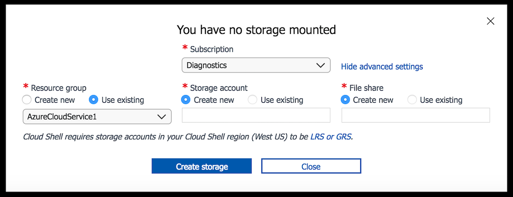

# Persist files in Azure Cloud Shell
Cloud Shell utilizes Azure File storage to persist files across sessions.

## Set up a clouddrive file share
On initial start, Cloud Shell prompts you to associate a new or existing file share to persist files across sessions.

> [!NOTE]
> Bash and PowerShell share the same file share. Only one file share can be associated with automatic mounting in Cloud Shell.

### Create new storage

When you use basic settings and select only a subscription, Cloud Shell creates three resources on your behalf in the supported region that's nearest to you:
* Resource group: `cloud-shell-storage-<region>`
* Storage account: `cs<uniqueGuid>`
* File share: `cs-<user>-<domain>-com-<uniqueGuid>`

The file share mounts as `clouddrive` in your `$Home` directory. This is a one-time action, and the file share mounts automatically in subsequent sessions. 

In Bash, the file share also contains a 5-GB image that is created for you which automatically persists data in your `$Home` directory. 

### Use existing resources

By using the advanced option, you can associate existing resources. When the storage setup prompt appears, select **Show advanced settings** to view additional options. The drop-down menus are filtered for your assigned Cloud Shell region and the locally redundant storage and geo-redundant storage accounts.

In Bash, existing file shares receive a 5-GB image created for you to persist your `$Home` directory.

### Restrict resource creation with an Azure resource policy
Storage accounts that you create in Cloud Shell are tagged with `ms-resource-usage:azure-cloud-shell`. If you want to disallow users from creating storage accounts in Cloud Shell, create an [Azure resource policy for tags](../articles/azure-policy/json-samples.md) that are triggered by this specific tag.

## Supported storage regions
Associated Azure storage accounts must reside in the same region as the Cloud Shell machine that you're mounting them to.

To find your assigned region you may:
* View the note on the "Advanced storage settings" dialog
* Refer to the name of the storage account created for you (ex: `cloud-shell-storage-westus`)
* Run `env` and locate the variable `ACC_LOCATION`

Cloud Shell machine exist in the following regions:
|Area|Region|
|---|---|
|Americas|East US, South Central US, West US|
|Europe|North Europe, West Europe|
|Asia Pacific|India Central, Southeast Asia|

