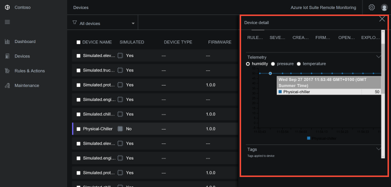
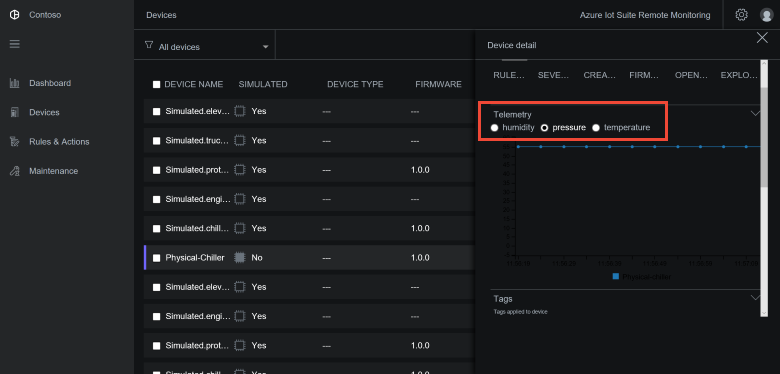
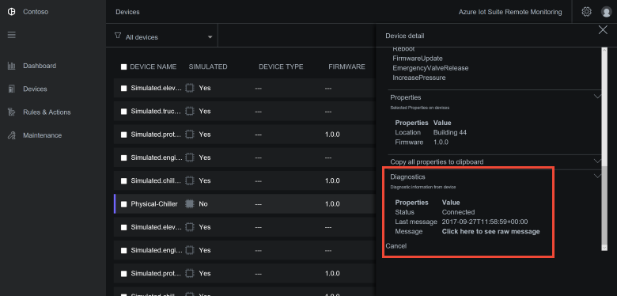
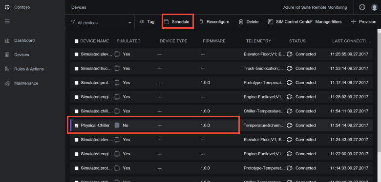
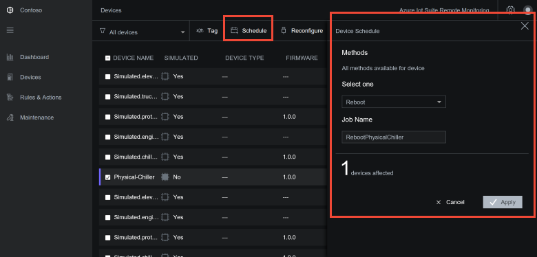

## View device telemetry

You can view the telemetry sent from your device on the **Devices** page in the solution.

1. Select the device you provisioned in the list of devices on the **Devices** page. A panel displays information about your device including a plot of the device telemetry:

    

1. Choose **Pressure** to change the telemetry display:

    

1. To view diagnostic information about your device, scroll down to **Diagnostics**:

    

## Act on your device

To invoke methods on your devices, use the **Devices** page in the remote monitoring solution. For example, in the remote monitoring solution **Chiller** devices implement a **Reboot** method.

1. Choose **Devices** to navigate to the **Devices** page in the solution.

1. Select the device you provisioned in the list of devices on the **Devices** page:

    

1. To display a list of the methods you can call on your device, choose **Schedule**. To schedule a method to run on multiple devices, you can select multiple devices in the list. The **Schedule** panel shows the types of method common to all the devices you selected.

1. Choose **Reboot**, set the job name to **RebootPhysicalChiller**, and choose **Apply**:

    

1. A message displays in the console running your device code when the device handles the method.

> [!NOTE]
> To track the status of the job in the solution, choose **View**.

## Next steps

The article [Customize the remote monitoring preconfigured solution](../articles/iot-suite/iot-suite-remote-monitoring-customize.md) describes some ways to customize the preconfigured solution.