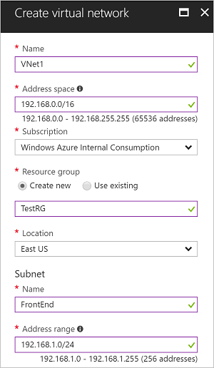

To create a VNet in the Resource Manager deployment model by using the Azure portal, follow the steps below. The screenshots are provided as examples. Be sure to replace the values with your own. For more information about working with virtual networks, see the [Virtual Network Overview](../articles/virtual-network/virtual-networks-overview.md).

>[!NOTE]
>If you want this VNet to connect to an on-premises location (in addition to creating a P2S configuration), you need to coordinate with your on-premises network administrator to carve out an IP address range that you can use specifically for this virtual network. If a duplicate address range exists on both sides of the VPN connection, traffic does not route the way you may expect it to. Additionally, if you want to connect this VNet to another VNet, the address space cannot overlap with other VNet. Take care to plan your network configuration accordingly.
>
>

1. From a browser, navigate to the [Azure portal](http://portal.azure.com) and, if necessary, sign in with your Azure account.
2. Click **+**. In the **Search the marketplace** field, type "Virtual Network". Locate **Virtual Network** from the returned list and click to open the **Virtual Network** page.

  
3. Near the bottom of the Virtual Network page, from the **Select a deployment model** list, select **Resource Manager**, and then click **Create**.

  
4. On the **Create virtual network** page, configure the VNet settings. When you fill in the fields, the red exclamation mark becomes a green check mark when the characters entered in the field are valid. There may be values that are auto-filled. If so, replace the values with your own. The **Create virtual network** page looks similar to the following example:

  
5. **Name**: Enter the name for your Virtual Network.
6. **Address space**: Enter the address space. If you have multiple address spaces to add, add your first address space. You can add additional address spaces later, after creating the VNet.
7. **Subscription**: Verify that the Subscription listed is the correct one. You can change subscriptions by using the drop-down.
8. **Resource group**: Select an existing resource group, or create a new one by typing a name for your new resource group. If you are creating a new group, name the resource group according to your planned configuration values. For more information about resource groups, visit [Azure Resource Manager Overview](../articles/azure-resource-manager/resource-group-overview.md#resource-groups).
9. **Location**: Select the location for your VNet. The location determines where the resources that you deploy to this VNet will reside.
10. **Subnet**: Add the subnet name and subnet address range. You can add additional subnets later, after creating the VNet.
11. Select **Pin to dashboard** if you want to be able to find your VNet easily on the dashboard, and then click **Create**.

 
12. After clicking **Create**, you will see a tile on your dashboard that will reflect the progress of your VNet. The tile changes as the VNet is being created.

  